# Design Document

## Overview

Promotion Management System (PMS) adalah aplikasi web SaaS internal multi-brand untuk tim marketplace. Sistem berfungsi sebagai single source of truth untuk perencanaan, pengelolaan, persetujuan, eksekusi, dan pengarsipan promo marketplace. Design ini menerjemahkan 24 requirement menjadi arsitektur, model data, kontrak antarmuka, properti korektnes, penanganan error, dan strategi pengujian.

### Prinsip Desain Utama

1. **Kepemilikan data berbasis Brand (multi-brand by design).** Setiap Product, Campaign, Promo_Scenario, dan Cost_Configuration dimiliki oleh tepat satu Brand. Brand adalah akar hierarki kepemilikan: `Brand → (Products, Campaigns, Promos, Cost_Configuration)`.
2. **Keunikan Product per Brand.** Identitas produk adalah kombinasi `(Brand + Product ID)`. Product ID yang sama boleh ada di Brand berbeda. Nama Produk tidak pernah menjadi kunci keunikan atau foreign key.
3. **Cost Configuration per Brand (penyimpangan sengaja dari PRD).** Simulasi promo selalu memakai Cost_Configuration aktif milik Brand pemilik promo.
4. **Referensi produk via Product record, bukan Nama Produk.** Promo_Scenario mereferensikan produk melalui identitas `(Brand + Product ID)`.
5. **Kontrol akses berbasis peran (RBAC).** SPV_Marketing memiliki hak tulis penuh sebagai satu kesatuan; Admin_Marketplace hanya membaca promo Approved dan menulis Feedback_Record.
6. **Auditabilitas.** Entitas utama (Brand, Campaign, Promo_Scenario, Product) membawa Audit_Fields (Created By, Created At, Updated At) yang immutable untuk Created By/Created At.
7. **Pemisahan MVP vs Nice-to-Have.** Modul wajib MVP (Brand Management, relasi Brand, Promo_Type, Feedback History, **Promo Clone**, **kapabilitas pencarian promo historis lintas campaign yang kini menjadi bagian dari Promo History**) dipisahkan dari fitur nice-to-have/opsional (Margin Health / Profitability Indicator, Attachments, Promo Execution gabungan) melalui feature flag. **Promo Clone merupakan kapabilitas MVP (mandatory) dan tidak lagi dibungkus feature flag; demikian pula kapabilitas pencarian lintas campaign yang dikonsolidasikan ke dalam Promo History (Req 16).**

### Lingkup

In-scope: seluruh requirement 1-24 (MVP inti + Brand Management + Promo Clone + kapabilitas pencarian promo historis lintas campaign sebagai bagian dari Promo History + fitur nice-to-have yang dibungkus feature flag). Out-of-scope (V2): Product Classification, Workflow Tracking, Scenario Comparison, AI Recommendation.

> **Catatan konsolidasi.** Rencana halaman **Promo Library** terpisah telah **dihapus** dan kapabilitasnya (pencarian lintas campaign + kombinasi filter Brand, Campaign, Promo Type, Status, dan Date Range) **dikonsolidasikan ke dalam Promo History (Req 16)**. Tidak ada lagi halaman, komponen, maupun requirement Promo Library/Req 25 yang berdiri sendiri.

> **Fasing delivery MVP (v1 / v1.1).** Urutan implementasi diatur dalam dua fase tanpa menurunkan requirement MANDATORY menjadi opsional. **MVP v1 (Core Operational Workflow)** mencakup: Brand Context, Product Master, Cost Configuration, Campaign Management, Promo Scenario, Dynamic Rule Builder, Product Selection, Promo Simulator, Approval Workflow, dan Promo Execution. **MVP v1.1 (Productivity & Historical Features)** mencakup: Feedback Thread, Promo Clone, Promo History (termasuk kapabilitas pencarian/Library yang telah dikonsolidasikan), Approval History, dan Additional Reporting. Fasing ini hanya menata urutan implementasi dan tidak mengubah ruang lingkup requirement.

> **Catatan prioritas MVP.** Seluruh correctness properties pada dokumen ini **dipertahankan** sebagai referensi dokumentasi dan pengujian — tidak ada satu pun yang dihapus. Namun untuk MVP, validasi korektnes **diutamakan melalui validasi bisnis normal** (validasi input, aturan domain, dan pengujian contoh pada alur operasional harian) tanpa lebih dulu membangun infrastruktur pengujian kompleks yang dapat menunda rilis. Implementasi MVP memprioritaskan **alur operasional dan UX harian** (perencanaan promo, simulasi kelayakan, approval, dan eksekusi) agar nilai produk dapat dirasakan pengguna lebih cepat. Infrastruktur correctness yang menyeluruh (property-based testing untuk seluruh Properti 1–45) dapat diterapkan secara **bertahap** seiring kematangan fitur, tanpa mengubah ruang lingkup requirement maupun menggugurkan properti yang sudah ditetapkan.

## Architecture

### Gaya Arsitektur

PMS adalah aplikasi web tiga lapis (three-tier) dengan domain layer yang murni (pure) agar logika bisnis dapat diuji secara independen:

- **Presentation Layer (Web Client + UI):** Halaman sidebar (Dashboard, Brand Management, Promo Management, Master Data, Reports). Bertanggung jawab atas rendering, filter, dan interaksi.
- **Application/API Layer:** Endpoint REST yang menegakkan RBAC, validasi request, orkestrasi transaksi, dan mapping error domain ke respons HTTP.
- **Domain Layer (pure logic):** Aturan bisnis murni — promo logic, rule selection, simulator (Margin/NPM), validasi keunikan, invariant konsistensi Brand, Margin_Health (Profitability Indicator). Tidak bergantung pada I/O sehingga dapat diuji dengan property-based testing.
- **Persistence Layer:** Repository untuk Brand, Product, Campaign, Promo_Scenario, Cost_Configuration, Promo_Template, Feedback_Record, Approval_History, dan Execution_Status. Menegakkan integritas relasional dan transaksi atomik.

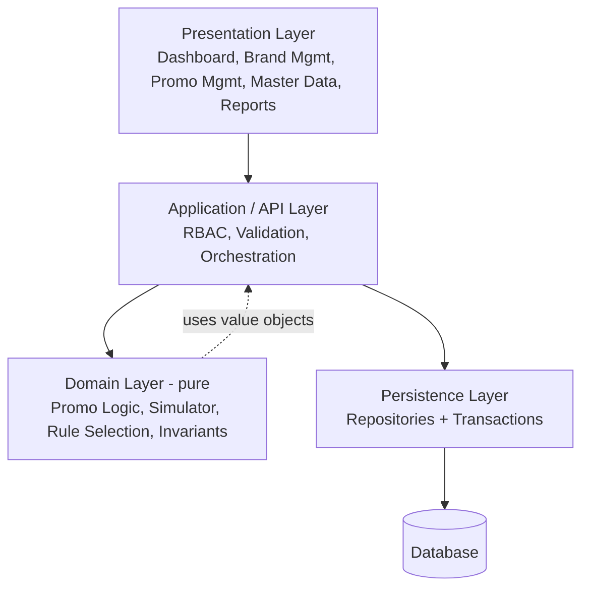

### Hierarki Kepemilikan Data

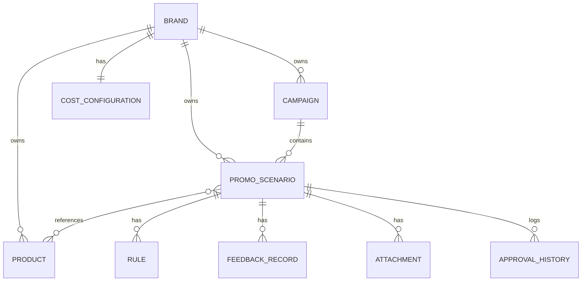

### Lapisan RBAC

RBAC ditegakkan di Application Layer sebelum operasi domain dijalankan. Hak akses SPV_Marketing terhadap kelima sumber daya tulis (Campaign, Promo_Scenario, Product_Master, Cost_Configuration, Promo_Template) bersifat all-or-nothing. Admin_Marketplace dibatasi pada read promo Approved dan create Feedback_Record. Pembuatan Feedback_Record diizinkan untuk setiap peran yang memiliki akses ke promo (utas dua arah).

### Konsistensi Dashboard (Pending Update)

Perubahan Campaign/Promo_Scenario membentuk kewajiban pembaruan tertunda (pending recompute) yang diselesaikan saat Dashboard berikutnya dimuat, sehingga widget selalu konsisten dengan data terkini tanpa memerlukan komputasi sinkron pada setiap mutasi.

## UX & Screen Design

Bagian ini menjabarkan rancangan antarmuka PMS berdasarkan UX Review. Fokus utamanya adalah **efisiensi operasional** bagi pengguna harian (SPV_Marketing dan Admin_Marketplace), bukan estetika konsumen. Rancangan ini menerjemahkan kebutuhan navigasi, alur kerja, dan tata letak layar ke dalam wujud konkret tanpa mengubah arsitektur, model data, maupun properti korektnes yang sudah ditetapkan.

### Prinsip UX

1. **Operational efficiency lebih utama daripada estetika.** PMS adalah alat kerja internal. Layar dirancang agar SPV_Marketing dapat menyusun promo dan Admin_Marketplace dapat mengeksekusi promo secepat mungkin, dengan informasi padat namun terbaca.
2. **Minimasi klik (fewest clicks).** Aksi yang paling sering dipakai (membuat promo, melihat simulator, mengubah status eksekusi) diletakkan sedekat mungkin dengan titik masuk. Promo_Simulator menempel langsung di bawah pemilihan produk agar SPV tidak perlu berpindah halaman untuk menilai kelayakan.
3. **Desktop-first, mobile sekunder.** Layar utama dioptimalkan untuk lebar desktop (tabel padat, multi-kolom, side-by-side simulator). Mobile difokuskan hanya pada **viewing & approval** — bukan pengisian data kompleks.
4. **Antarmuka sesuai peran (role-aware).** SPV_Marketing melihat antarmuka penuh; Admin_Marketplace melihat antarmuka tersederhanakan yang langsung mengarah ke promo yang butuh aksi (mendukung Req 1.3, 1.6).
5. **Global Brand context.** Pemilihan Brand dilakukan satu kali di top app bar dan otomatis memfilter seluruh layar, menghindari pemilihan Brand berulang per modul (mendukung Req 2.5, 3.15, 13.3, 15.2).
6. **Cegah aksi destruktif.** Workflow utama menyediakan Edit dan Archive, bukan permanent delete, agar data historis tetap valid (sejalan dengan Req 3.10, 6.8, 19.6).
7. **Actionable-first (utamakan metrik yang dapat ditindaklanjuti).** Dashboard dan ringkasan diprioritaskan untuk metrik operasional harian yang menuntut aksi (promo menunggu review, promo menunggu eksekusi, promo aktif). Metrik historis menyeluruh (Total Campaign, Total Promo) tetap tersedia namun disajikan sebagai informasi sekunder, bukan fokus utama tata letak.

### Page Hierarchy / Navigation

Struktur navigasi mengikuti sidebar yang disepakati pada requirements, dengan Global Brand Selector pada top app bar yang berlaku lintas modul.

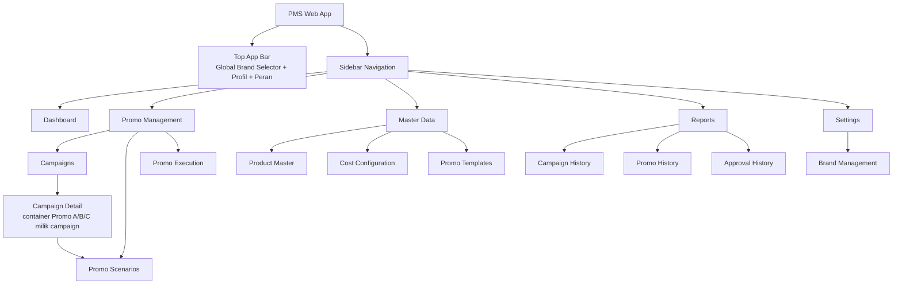

> **Catatan penempatan navigasi — Brand Management di bawah Settings.** Brand Management (Req 19) dipindahkan dari navigasi primer ke grup **Settings**. Pembuatan Brand adalah **tugas administratif yang jarang** (Brand baru dibuat sekali lalu jarang berubah), sehingga navigasi primer difokuskan pada **workflow operasional harian** — Campaigns, Promos, dan Execution. Pemindahan ini murni soal **penempatan navigasi**; seluruh kapabilitas Brand Management (create, update, archive, delete dengan proteksi referensi sesuai Req 19) tetap utuh dan tidak berubah.

> **Catatan konsolidasi Reports.** Reports terdiri dari **Campaign History, Promo History, dan Approval History**. Halaman **Promo Library** terpisah telah dihapus; kapabilitas pencarian promo historis lintas campaign kini menjadi bagian dari **Promo History** (Req 16).

#### Global Brand Selector (top app bar)

Global Brand Selector adalah dropdown Brand yang berada di top app bar dan terlihat di semua halaman. Brand yang terpilih menjadi **konteks aktif** yang otomatis memfilter:

- Widget dan Recent Activity pada Dashboard (Req 2.5).
- Listing Product Master (Req 3.15).
- Approved_Promos (Req 13.3).
- Campaign History, Promo History, dan listing Reports lain (Req 15.2, Req 16).
- Default Brand pada form pembuatan Campaign/Promo (mengurangi klik; tetap dapat divalidasi konsistensi Brand promo == Brand campaign).

Pemilihan Brand bersifat sticky selama sesi. Bila pengguna mengganti Brand, seluruh widget, campaign, promo, dan reports yang sedang tampil dihitung ulang mengikuti Brand baru tanpa perlu memilih ulang filter di tiap modul.

#### Navigasi berbasis peran (role-aware navigation)

Navigasi yang ditampilkan bergantung pada peran pengguna (Req 1.2, 1.3, 1.6):

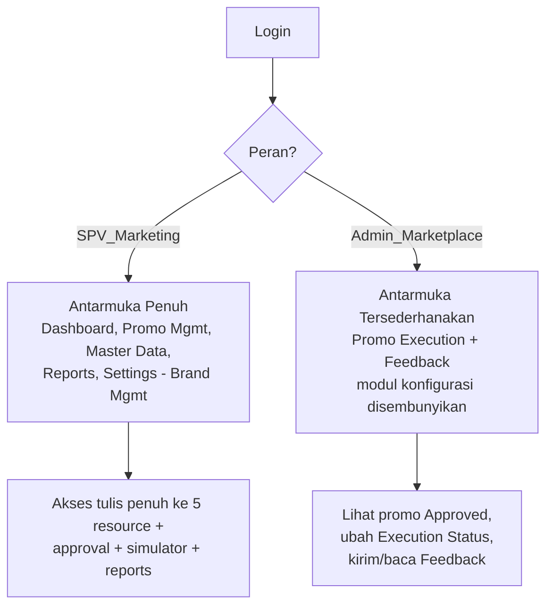

- **SPV_Marketing:** seluruh item sidebar tampil dan dapat ditulis (all-or-nothing sesuai RBAC).
- **Admin_Marketplace:** sidebar dipangkas. Item Master Data (Product Master, Cost Configuration, Promo Templates), Settings (Brand Management), dan pembuatan Campaign/Promo Scenario **disembunyikan**. Admin masuk langsung ke Promo Execution (daftar promo Approved yang butuh aksi) dan utas Feedback. Upaya mengakses fungsi konfigurasi tetap ditolak di lapisan API (Req 1.6) — penyembunyian di UI hanya lapisan kenyamanan, bukan satu-satunya penegak akses.

### User Flows

#### Flow 1 — SPV membuat Promo Scenario

Alur paling sering dipakai. Promo_Simulator tampil inline agar penilaian kelayakan terjadi tanpa pindah halaman (minimasi klik). SPV juga dapat **membuat Campaign baru secara inline** langsung dari field Campaign bila campaign yang dituju belum ada, sehingga promo dapat ditentukan lebih dahulu lalu campaign-nya dibuat. Mendukung Req 7 (termasuk 7.12–7.14), 8, 9, 11, 12.

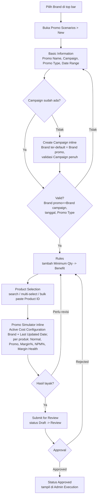

#### Flow 2 — Admin mengeksekusi promo & memberi feedback (utas dua arah)

Mendukung Req 14 dan Req 18. Admin tidak membuat promo; ia melihat promo Approved, menyiapkannya di marketplace, memperbarui Execution_Status, dan berkomunikasi via Feedback.

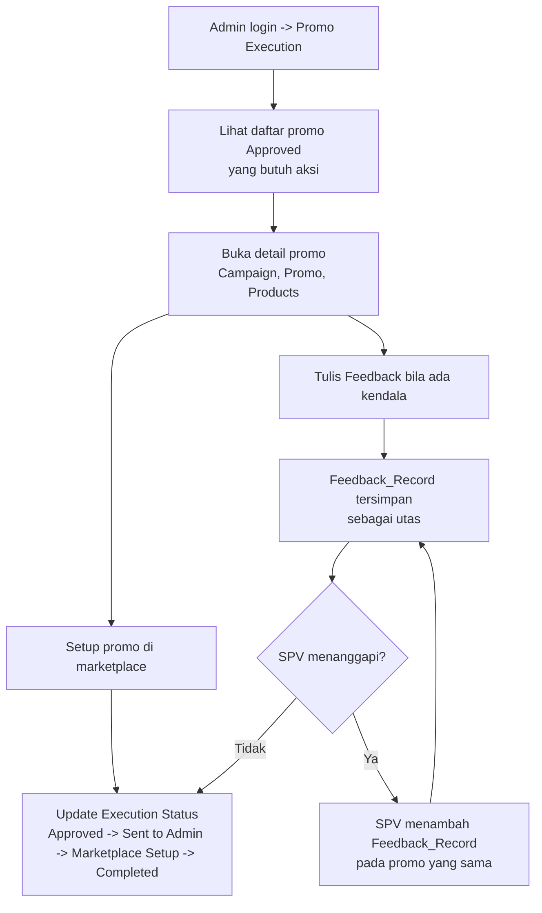

#### Flow 3 — Pemilihan Brand global

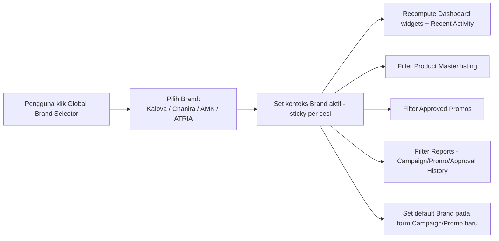

#### Flow 4 — Menelusuri Campaign dan promo di dalamnya

Mendukung relasi one-to-many Campaign → Promo_Scenario (Req 6.10, 6.11) dan penelusuran riwayat (Req 15). Campaign Detail berfungsi sebagai container yang menampilkan seluruh Promo_Scenario milik sebuah Campaign.

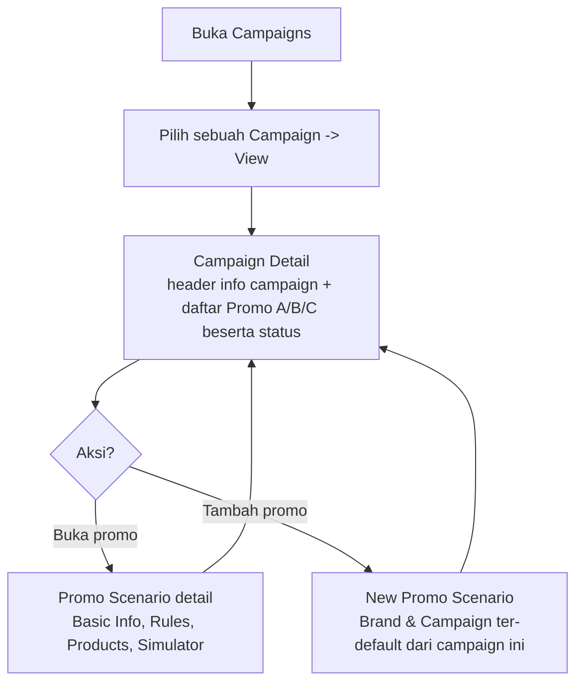

#### Flow 5 — SPV menduplikasi promo (Clone) sebagai aksi first-class

Mendukung Req 24 dan Property 43. **Clone** tersedia sebagai aksi baris first-class pada daftar promo (Promo Scenarios list, Campaign Detail, dan Promo History) bersama View, Edit, dan Archive. Clone mempercepat penyiapan promo berulang (mis. Payday, Serbu Rabu, Flash Sale) tanpa membuat ulang dari awal: menyalin Promo_Type, Rules, dan Product List; promo hasil klona dimulai dengan Status Draft dan memperoleh field audit baru.

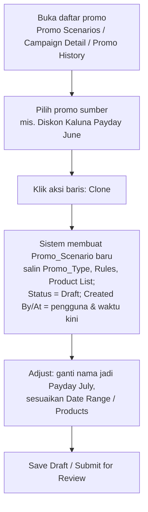

### Wireframes Desktop (ASCII)

Wireframe berikut menggambarkan tata letak desktop-first. Top app bar dengan Global Brand Selector konsisten di seluruh layar.

#### Dashboard

Mendukung Req 2.1–2.7. Tata letak menerapkan prinsip **actionable-first**: baris atas menonjolkan metrik operasional harian yang menuntut aksi (Pending Review, Waiting for Execution, Active, Completed). Di bawahnya terdapat **Work Queue (antrian kerja personal)** sesuai Req 2.6 yang menampilkan Pending Reviews, Rejected Promos, Unread Feedback, dan Waiting for Execution. Seluruh indikator Work Queue mengikuti konteks Global Brand Selector (Req 2.7) — hanya menghitung Promo_Scenario dan Feedback_Record milik Brand aktif. Metrik historis (Total Campaign, Total Promo) tetap ada sesuai Req 2.1 namun disajikan sebagai metrik sekunder pada baris bawah. Widget Draft, Review, Approved, dan Rejected tetap tersedia (Req 2.1) — penonjolan di sini murni soal tata letak, bukan penghapusan widget yang diwajibkan requirement.

```
+--------------------------------------------------------------------------------+
| PMS    [ Brand: Kalova v ]                         SPV Marketing  (Andi)  [v]  |
+----------------+---------------------------------------------------------------+
| > Dashboard    |  DASHBOARD                              Brand aktif: Kalova   |
|   Promo Mgmt   |                                                               |
|     Campaigns  |  PERLU AKSI (actionable-first)                                |
|     Scenarios  |  +-------------+ +-------------+ +-------------+ +-----------+ |
|     Execution  |  | Promo       | | Promo       | | Active      | | Completed | |
|   Master Data  |  | PENDING     | | WAITING FOR | | Promos      | | Promos    | |
|     Products   |  | REVIEW      | | EXECUTION   | |             | |           | |
|     Cost Conf  |  |    7        | |    4        | |    9        | |    13     | |
|     Templates  |  +-------------+ +-------------+ +-------------+ +-----------+ |
|   Reports      |   ^Promo Review  ^Approved blm   ^Promo Active   ^Promo        |
|     Campaign H |    (Req 2.1)      tereksekusi      (Req 2.1)       Completed    |
|     Promo Hist |                                                               |
|     Approval H |  WORK QUEUE (antrian kerja personal - ikut filter Brand)      |
|   Settings     |  +-------------+ +-------------+ +-------------+ +-----------+ |
|     Brand Mgmt |  | Pending     | | Rejected    | | Unread      | | Waiting   | |
|                |  | Reviews     | | Promos      | | Feedback    | | for Exec  | |
|                |  |    7        | |    2        | |    3        | |    4      | |
|                |  +-------------+ +-------------+ +-------------+ +-----------+ |
|                |   ^status Review ^status Reject  ^Feedback blm   ^Approved blm |
|                |    (Req 2.6)      (Req 2.6)       dibaca (2.6)     Completed     |
|                |                                                               |
|                |  RINGKASAN HISTORIS (sekunder)                                |
|                |  +----------+ +----------+   Draft: 7  Approved: 19           |
|                |  | Total    | | Total    |   Rejected: 2                       |
|                |  | Campaign | | Promo    |   (widget Draft/Review/Approved/    |
|                |  |   12     | |   48     |    Rejected/Active/Completed tetap   |
|                |  +----------+ +----------+    tersedia sesuai Req 2.1)         |
|                |                                                               |
|                |  RECENT CAMPAIGNS                 RECENT PROMOS               |
|                |  +----------------------------+   +--------------------------+ |
|                |  | Payday Sept   Active  3 P  |   | Diskon Kaluna  Approved  | |
|                |  | Serbu Rabu    Draft   1 P  |   | Flash AMK 9.9  Review    | |
|                |  | Flash 9.9     Active  5 P  |   | Bundle Chanira Draft     | |
|                |  +----------------------------+   +--------------------------+ |
+----------------+---------------------------------------------------------------+
```

Keterangan pemetaan widget actionable ke status promo (tetap konsisten Req 2.1/2.2):

- **Promo Pending Review** = jumlah Promo_Scenario berstatus Review (menunggu keputusan approval SPV).
- **Promo Waiting for Execution** = jumlah promo berstatus Approved yang Execution_Status-nya belum Completed (menunggu/sedang disiapkan Admin).
- **Active Promos** = jumlah Promo_Scenario berstatus Active.
- **Completed Promos** = jumlah Promo_Scenario berstatus Completed.
- **Total Campaign / Total Promo** = total historis (metrik sekunder), tetap ditampilkan sesuai Req 2.1.

Keterangan indikator **Work Queue** (Req 2.6, dihitung mengikuti filter Brand pada Req 2.7):

- **Pending Reviews** = jumlah Promo_Scenario berstatus Review.
- **Rejected Promos** = jumlah Promo_Scenario berstatus Rejected.
- **Unread Feedback** = jumlah Feedback_Record yang belum dibaca oleh pengguna saat ini.
- **Waiting for Execution** = jumlah Promo_Scenario berstatus Approved yang Execution_Status-nya belum Completed.

#### Promo Scenario (layar paling sering dipakai)

Mendukung Req 7 (Basic Information, termasuk 7.12–7.14 create campaign inline), Req 8 (Rules), Req 9 (Product Selection), Req 11 & Req 20 (Simulator + Margin Health / Profitability Indicator). Simulator tampil inline tepat di bawah produk terpilih, dengan **Summary View** menonjol di atas dan **Detailed View** per produk yang dapat di-expand/toggle. Field Campaign menyediakan opsi **"+ Create new campaign"** inline (Req 7.12) sehingga SPV dapat membuat Campaign baru tanpa keluar dari alur pembuatan promo. Simulator juga menampilkan **Active Cost Configuration** milik Brand promo beserta **Last Updated Date** (Req 11.8) agar hasil simulasi dapat dipercaya.

```
+--------------------------------------------------------------------------------+
| PMS    [ Brand: Kalova v ]                         SPV Marketing  (Andi)  [v]  |
+----------------+---------------------------------------------------------------+
|  Promo Scenario > New                              [ Save Draft ] [ Submit ]   |
+----------------+---------------------------------------------------------------+
|  BASIC INFORMATION                                                             |
|  Promo Name : [ Diskon Kaluna September              ]                         |
|  Campaign   : [ Payday Sept (Kalova)            v ]   Promo Type: [ Buy X Discount v ] |
|               [ + Create new campaign inline ]  <- Req 7.12 (Brand ter-default = Brand promo) |
|  Date Range : [ 01-09-2025 ] s/d [ 30-09-2025 ]                                |
|  - - - - - - - - - - - - - - - - - - - - - - - - - - - - - - - - - - - - - - - |
|  [inline new campaign] Name:[ Payday Okt ] Brand:[ Kalova (terkunci=Brand promo)] |
|     Period:[ 01-10-2025 ]s/d[ 31-10-2025 ]  [ Save Campaign ]  (validasi penuh Req 7.13/7.14) |
+--------------------------------------------------------------------------------+
|  RULES                                                       [ + Add Rule ]     |
|  +-------------------+------------------------------+---------+                 |
|  | Minimum Qty       | Benefit                      | Action  |                 |
|  +-------------------+------------------------------+---------+                 |
|  | 2                 | Discount 10%                 | [Del]   |                 |
|  | 5                 | Discount 20%                 | [Del]   |                 |
|  +-------------------+------------------------------+---------+                 |
+--------------------------------------------------------------------------------+
|  PRODUCT SELECTION                                                             |
|  Search: [ Product ID / Nama Produk        ]  [ + Multi-select ] [ Bulk Paste ]|
|  Bulk Paste IDs: [ 12345 12346 12347 ... (spasi/baris baru) ]   [ Add ]        |
|  - - - - - - - - - - - - - - - - - - - - - - - - - - - - - - - - - - - - - - - |
|  [future] Category Filter: [ Semua Kategori v ]   [ Select All ]  [ Group v ]  |
|           (opsional - dukungan skala besar, lihat catatan future scope)        |
|  - - - - - - - - - - - - - - - - - - - - - - - - - - - - - - - - - - - - - - - |
|  Selected:  KAL-12345 Kaluna  |  KAL-12346 Kaluna XL  |  KAL-12347 Serum  [x]   |
+--------------------------------------------------------------------------------+
|  PROMO SIMULATOR  (inline, real-time)                                          |
|  Active Cost Configuration: Kalova  |  Last Updated: 25-08-2025  (Req 11.8)     |
|  SUMMARY VIEW                                                                  |
|  +----------------+----------------+----------------+----------------+          |
|  | Total Products | Healthy        | Warning        | Risky          |          |
|  |      3         |   1 (Healthy)  |   1 (Warning)  |   1 (Risky)    |          |
|  +----------------+----------------+----------------+----------------+          |
|   (agregat diturunkan dari Margin_Health tiap produk, Req 20)                  |
|                                                                                |
|  DETAILED VIEW (per produk)                          [ v Expand / Collapse ]   |
|  +-----------+-----------+-----------+----------+--------+--------------------+  |
|  | Product   | Normal Rp | Promo Rp  | Margin % | NPM %  | Margin Health      |  |
|  +-----------+-----------+-----------+----------+--------+--------------------+  |
|  | KAL-12345 | 100.000   | 80.000    |  32%     |  22%   | * Healthy          |  |
|  | KAL-12346 | 150.000   | 120.000   |  18%     |  12%   | ! Warning          |  |
|  | KAL-12347 |  90.000   | 72.000    |   9%     |   4%   | x Risky            |  |
|  +-----------+-----------+-----------+----------+--------+--------------------+  |
+----------------+---------------------------------------------------------------+
```

**Save Draft selalu terlihat (working state normal).** Tombol **[ Save Draft ]** ditampilkan permanen di header layar Promo Scenario di sepanjang proses pembuatan (berdampingan dengan **[ Submit ]**), tidak tersembunyi di balik menu maupun langkah akhir. Draft adalah **working state normal**: alur tipikal adalah **Create → Save Draft → Continue Later → Submit for Review**, sehingga SPV dapat menyimpan progres kapan saja (Basic Information, Rules, atau Product Selection yang belum lengkap) lalu melanjutkan di sesi berikutnya tanpa kehilangan data. Submit for Review hanya mengubah Status Draft → Review; menyimpan sebagai Draft tidak pernah memicu validasi approval. Hal ini sejalan dengan Status awal Draft pada Req 7.1 dan transisi approval Req 12.1.

**Simulator: Active Cost Configuration + Summary View + Detailed View.** Di bagian atas Simulator ditampilkan penanda **Active Cost Configuration** milik Brand promo beserta **Last Updated Date** (Req 11.8), sehingga SPV tahu persis basis biaya yang dipakai dan kapan terakhir diperbarui sebelum mempercayai hasil. **Summary View adalah fokus/view utama** dan menampilkan agregat lintas seluruh produk terpilih: **Total Products**, **Healthy Products**, **Warning Products**, dan **Risky Products**. Untuk promo berskala besar (mis. **50+ atau 100+ produk**), Summary View inilah yang menjadi pegangan utama SPV — membaca tabel per-produk satu per satu menjadi tidak praktis, sehingga ringkasan kesehatan agregat memberi gambaran cepat kelayakan promo secara keseluruhan dalam sekali pandang. Keempat agregat ini diturunkan dengan menghitung jumlah produk per nilai Margin_Health (Healthy/Warning/Risky) sesuai aturan klasifikasi NPM% pada Req 20 (dan Property 40). Margin_Health bersifat **analitis/pendukung keputusan (Profitability Indicator)** dan TIDAK memengaruhi proses approval. Tabel **Detailed View per produk** (Harga Normal, Harga Promo, Margin %, NPM %, Margin Health) tetap dapat diakses melalui **expandable view** (expand/collapse), namun bukan fokus utama tampilan — khususnya pada promo dengan banyak produk. Detailed View tetap menyajikan ketujuh keluaran simulator lengkap (lihat Components and Interfaces — `Simulator.simulate`) sehingga tidak ada informasi Req 11.1 yang hilang.

> **Catatan future scope — Product Selection skala besar.** Untuk Brand dengan ratusan SKU, pemilihan produk satu per satu menjadi tidak efisien. Sebagai **enhancement ke depan (bukan MVP)**, Product Selection dapat dilengkapi: **Category Filter** (menyaring produk berdasarkan Kategori dari Product_Master), **Select All** (memilih seluruh produk hasil filter aktif dalam satu aksi, tetap dibatasi Brand promo & Status Active sesuai Req 9.11/9.13), dan **Product Grouping** (mengelompokkan daftar produk per Kategori untuk navigasi lebih cepat). Elemen-elemen ini ditandai `[future]` pada wireframe sebagai opsional dan **tidak mengubah ruang lingkup MVP** — perilaku inti pemilihan produk (search, multi-select, bulk paste, batasan Brand/Status) tetap sebagaimana ditetapkan Req 9.

#### Product Master

Mendukung Req 3. Aksi pada baris adalah Edit & Archive (tanpa permanent delete pada workflow utama, sejalan Req 3.10/3.11). Kolom **Brand** tetap ditampilkan pada listing meskipun Global Brand Selector sedang aktif (Req 3.17), agar visibilitas Brand terjaga untuk keperluan export, import, dan review operasional.

```
+--------------------------------------------------------------------------------+
| PMS    [ Brand: Kalova v ]                         SPV Marketing  (Andi)  [v]  |
+----------------+---------------------------------------------------------------+
|  Product Master            [ + Add Product ] [ Import Excel ] [ Import CSV ]    |
|  Search: [ Product ID / Nama Produk            ]            Brand: Kalova       |
+--------------------------------------------------------------------------------+
|  +--------+--------------+--------+---------+---------+---------+-------+-----+  |
|  | Prod ID| Product Name | Brand  | Category| HPP     |SellPrice| Status|Act. |  |
|  +--------+--------------+--------+---------+---------+---------+-------+-----+  |
|  | 12345  | Kaluna       | Kalova | Skincare| 45.000  | 100.000 | Active|E /A |  |
|  | 12346  | Kaluna XL    | Kalova | Skincare| 60.000  | 150.000 | Active|E /A |  |
|  | 12340  | Serum Lama   | Kalova | Skincare| 30.000  |  70.000 |Archvd |E /A |  |
|  +--------+--------------+--------+---------+---------+---------+-------+-----+  |
|     (E = Edit, A = Archive)                                                     |
|     Catatan: kolom Brand tetap tampil walau Global Brand Selector aktif         |
|     (Req 3.17 - untuk export/import/review).                                    |
+----------------+---------------------------------------------------------------+
```

#### Campaign Management

Mendukung Req 6 dan Req 15. Campaign adalah container banyak promo (one-to-many). Aksi: View / Edit / Archive.

```
+--------------------------------------------------------------------------------+
| PMS    [ Brand: Kalova v ]                         SPV Marketing  (Andi)  [v]  |
+----------------+---------------------------------------------------------------+
|  Campaigns                                              [ + New Campaign ]      |
+--------------------------------------------------------------------------------+
|  +------------------+--------+-----------+-----------+----------+--------+-----+ |
|  | Campaign Name    | Brand  | Start Date| End Date  | Status   | Promos |Act. | |
|  +------------------+--------+-----------+-----------+----------+--------+-----+ |
|  | Payday Sept      | Kalova | 01-09-25  | 30-09-25  | Active   |  3     |V/E/A| |
|  | Serbu Rabu       | Kalova | 10-09-25  | 10-09-25  | Draft    |  1     |V/E/A| |
|  | Flash 9.9        | Kalova | 09-09-25  | 09-09-25  | Completed|  5     |V/E/A| |
|  +------------------+--------+-----------+-----------+----------+--------+-----+ |
|     (V = View, E = Edit, A = Archive)  -- 1 Campaign menampung banyak Promo     |
+----------------+---------------------------------------------------------------+
```

Aksi **View** pada sebuah Campaign membuka **Campaign Detail Page** (lihat di bawah).

#### Campaign Detail Page

Halaman ini berfungsi sebagai **container** yang menampilkan seluruh Promo_Scenario milik satu Campaign, mewujudkan relasi one-to-many Campaign → Promo_Scenario (Req 6.10, 6.11) dan mendukung penelusuran riwayat campaign (Req 15). Header menampilkan info campaign; daftar di bawahnya menampilkan tiap Promo (A/B/C) beserta status, jumlah produk, dan aksi buka promo. Tombol "+ Add Promo to this Campaign" membuat Promo_Scenario baru dengan Brand & Campaign yang sudah ter-default dari campaign ini (validasi konsistensi Brand promo == Brand campaign tetap berlaku, Req 6.12/7.3).

```
+--------------------------------------------------------------------------------+
| PMS    [ Brand: Kalova v ]                         SPV Marketing  (Andi)  [v]  |
+----------------+---------------------------------------------------------------+
|  Campaigns > Payday Sept                          [ Edit ] [ Archive ]         |
+----------------+---------------------------------------------------------------+
|  CAMPAIGN INFO                                                                 |
|  Name   : Payday Sept            Brand : Kalova        Status : Active         |
|  Period : 01-09-2025 s/d 30-09-2025                    Total Promo : 3         |
|  Created By : Andi  |  Created At : 28-08-2025  |  Updated At : 01-09-2025      |
+--------------------------------------------------------------------------------+
|  PROMOS DALAM CAMPAIGN INI                       [ + Add Promo to this Campaign ]|
|  +-----+--------------------+----------------+----------+----------+-----------+ |
|  | No  | Promo Name         | Promo Type     | Products | Status   | Action    | |
|  +-----+--------------------+----------------+----------+----------+-----------+ |
|  | A   | Diskon Kaluna Sept | Buy X Discount |   3      | Approved | V/E/C/A   | |
|  | B   | Flash Kaluna 9.9   | Flash Sale     |   5      | Review   | V/E/C/A   | |
|  | C   | Bundle Kaluna Hemat| Bundle Promo   |   2      | Draft    | V/E/C/A   | |
|  +-----+--------------------+----------------+----------+----------+-----------+ |
|     (V=View buka Promo Scenario detail, E=Edit, C=Clone, A=Archive;             |
|      1 Campaign -> banyak Promo, Req 6.11; Clone = Req 24 / Property 43)         |
+----------------+---------------------------------------------------------------+
```

#### Admin Marketplace (simplified)

Antarmuka tersederhanakan untuk Admin_Marketplace. Langsung menampilkan promo Approved yang butuh aksi, Execution_Status yang dapat diperbarui, dan utas Feedback. Mendukung Req 1.3, 14, 18.

```
+--------------------------------------------------------------------------------+
| PMS    [ Brand: Kalova v ]                    Admin Marketplace  (Budi)   [v]  |
+----------------+---------------------------------------------------------------+
| > Promo Exec   |  PROMO EXECUTION  -  Promo Approved yang butuh aksi           |
|   Feedback     |                                                               |
|                |  +----------------+----------+----------------------+-------+  |
| (konfigurasi   |  | Promo          | Products | Execution Status     | Act.  |  |
|  disembunyikan)|  +----------------+----------+----------------------+-------+  |
|                |  | Diskon Kaluna  |   3      | [ Sent to Admin   v ]| Open  |  |
|                |  | Flash AMK 9.9  |   5      | [ Marketplace Set v ]| Open  |  |
|                |  | Bundle Chanira |   2      | [ Approved        v ]| Open  |  |
|                |  +----------------+----------+----------------------+-------+  |
|                |                                                               |
|                |  FEEDBACK (utas dua arah) - Diskon Kaluna                     |
|                |  +-----------------------------------------------------------+ |
|                |  | Budi (Admin)  02-09 09:10  "Stok gift terbatas, ok?"      | |
|                |  | Andi (SPV)    02-09 09:25  "Sudah ditambah, lanjut."      | |
|                |  | [ Tulis feedback...                            ] [ Send ] | |
|                |  +-----------------------------------------------------------+ |
+----------------+---------------------------------------------------------------+
```

#### Promo History (Reports) — daftar riwayat + pencarian & filter lintas campaign

Mendukung Req 16 (MANDATORY/MVP). Promo History adalah satu-satunya halaman riwayat promo lintas campaign: ia menampilkan daftar seluruh Promo_Scenario historis **sekaligus** menyediakan pencarian kata kunci (Nama Promo) dan kombinasi filter Brand, Campaign, Promo Type, Status, dan Date Range (kombinasi **AND**). Date Range bersifat **inklusif** pada batas awal & akhir (berdasarkan Tanggal Dibuat), dan tombol **Reset Filters** mengembalikan seluruh promo historis lintas campaign. Kapabilitas pencarian yang sebelumnya direncanakan sebagai halaman Promo Library terpisah telah **dikonsolidasikan ke dalam Promo History ini** — tidak ada halaman Promo Library yang berdiri sendiri.

Setiap baris menyediakan aksi baris first-class: **View, Edit, Clone, Archive** (Clone konsisten dengan Property 43 dan Flow 5).

```
+--------------------------------------------------------------------------------+
| PMS    [ Brand: Kalova v ]                         SPV Marketing  (Andi)  [v]  |
+----------------+---------------------------------------------------------------+
|  Reports > Promo History                                                       |
+----------------+---------------------------------------------------------------+
|  PENCARIAN & FILTER PROMO HISTORIS LINTAS CAMPAIGN                              |
|  Search   : [ Nama Promo ...                  ]   (kata kunci pada Nama Promo) |
|  Brand    : [ Semua / Kalova v ]   Campaign : [ Semua / Payday Sept v ]        |
|  PromoType : [ Semua / Buy X Discount v ]   Status : [ Semua / Approved v ]    |
|  Date Range: [ 01-01-2025 ] s/d [ 31-12-2025 ]  (inklusif batas awal & akhir)  |
|             [ Search ]   [ Reset Filters ]                                      |
+--------------------------------------------------------------------------------+
|  HASIL (kombinasi filter = AND)                                                |
|  +--------------+--------+------------+--------------+-----+--------+---------+ |
|  | Promo Name   | Brand  | Campaign   | Promo Type   |Prod | Status | Action  | |
|  +--------------+--------+------------+--------------+-----+--------+---------+ |
|  | Diskon Kaluna| Kalova | Payday Sept| Buy X Discount| 3  |Approved|V/E/C/A | |
|  | Flash Kaluna | Kalova | Flash 9.9  | Flash Sale    | 5  |Complete|V/E/C/A | |
|  | Bundle Hemat | Kalova | Serbu Rabu | Bundle Promo  | 2  | Draft  |V/E/C/A | |
|  +--------------+--------+------------+--------------+-----+--------+---------+ |
|     (V=View, E=Edit, C=Clone, A=Archive)                                       |
|     (kosong -> "Tidak ada hasil yang cocok", Req 16.6)                          |
+----------------+---------------------------------------------------------------+
```

### Mobile Consideration

PMS bersifat **desktop-first**. Layar pengisian data kompleks (Promo Scenario dengan Rules, Product Selection, dan Simulator; Product Master import; Cost Configuration) dioptimalkan untuk desktop dan tidak ditujukan untuk entri via mobile.

Pada mobile, ruang lingkup sengaja dipersempit menjadi **viewing & approval**:

- Melihat Dashboard ringkas (summary cards) dengan konteks Global Brand Selector.
- Melihat daftar promo Approved dan detailnya.
- Melakukan approval/penolakan promo (Draft/Review → Approved/Rejected) bagi SPV_Marketing.
- Membaca dan menulis Feedback singkat.

Tabel padat (Promo Simulator, Product Master, Campaign list) pada mobile disajikan sebagai kartu yang dapat di-scroll/collapse, read-only, dengan aksi berat diarahkan kembali ke desktop. Pendekatan ini menjaga kecepatan dan kemudahan tanpa memaksakan tata letak desktop ke layar kecil.

## Components and Interfaces

### Authentication & Access Control (Req 1)

- `AccessController.authorize(user, action, resourceType) -> Allow | Deny(message)`
- Aturan: SPV_Marketing → izinkan seluruh aksi tulis pada lima resource; Admin_Marketplace → tolak aksi tulis pada lima resource, izinkan read promo Approved + create feedback. Penolakan mengembalikan pesan akses ditolak.

### Brand Management (Req 19)

- `BrandService.create(brand)` — validasi keunikan Brand ID, simpan dengan audit fields.
- `BrandService.update(brandId, changes)` — simpan hanya bila seluruh validasi/constraint lolos.
- `BrandService.delete(brandId)` — hapus hanya bila tidak ada Product/Campaign/Promo terkait; jika ada, tolak.
- `BrandService.archive(brandId)` — tandai arsip tanpa menghapus.

### Product Master (Req 3, 9 supporting)

- `ProductService.create(product)` — validasi `(Brand + Product ID)` unik; warning bila Product ID dipakai di Brand lain namun tetap simpan; validasi Brand ada; Nama Produk tanpa batasan keunikan.
- `ProductService.update / archive / delete` — delete hanya bila tidak direferensikan promo, jika direferensikan tolak dan arahkan ke Archive.
- `ProductService.import(file)` — parse Excel/CSV; buat satu entri per baris valid; kumpulkan baris gagal ke daftar gagal.
- `ProductService.search(keyword, brandFilter)` — cocokkan substring pada Nama Produk atau Product ID.

### Cost Configuration (Req 4)

- `CostConfigService.get(brandId) -> CostConfiguration` (10 komponen persen).
- `CostConfigService.update(brandId, components)` — validasi setiap komponen dalam rentang 0-100; tolak seluruh perubahan bila ada yang di luar rentang (atomic).

### Promo Templates (Req 5)

- `TemplateService.listBuiltIn()` — Buy X Discount Y%, Buy X Get Free Gift, Voucher Discount, Flash Sale, Bundle Promo.
- `TemplateService.create / update / delete` — jumlah tak terbatas; error spesifik tanpa kehilangan data bila gagal.

### Campaign Management (Req 6, 7)

- `CampaignService.create(campaign)` — Status awal Draft; validasi tanggal (Selesai ≥ Mulai) dan Brand ada.
- `CampaignService.update / archive / delete` — delete hanya bila tanpa Promo terkait; jika ada, tolak & arahkan Archive.
- `CampaignService.createInline(campaign, promoBrandId)` — membuat Campaign baru di tengah alur pembuatan Promo_Scenario (Req 7.12); menerapkan **seluruh validasi Campaign** (Brand wajib, Selesai ≥ Mulai, Status awal Draft, audit fields) sesuai Req 7.13; menolak bila Brand campaign ≠ Brand promo yang sedang dibuat (Req 7.14).
- Membedakan error sistem (mis. kegagalan DB) dari error validasi input.

### Promo Scenario (Req 7, 8, 9, 10)

- `PromoService.create(promo)` — Status awal Draft; wajib terkait tepat satu Campaign; Brand promo == Brand Campaign; validasi tanggal, Brand, Promo_Type.
- `PromoService.createWithInlineCampaign(promo, newCampaign)` — alur pembuatan promo dengan opsi membuat Campaign baru secara inline (Req 7.12); mendelegasikan pembuatan campaign ke `CampaignService.createInline` dengan Brand ter-default = Brand promo, lalu mengaitkan promo ke campaign baru tersebut. Validasi konsistensi Brand campaign == Brand promo tetap ditegakkan (Req 7.14), dan seluruh validasi Campaign tetap berlaku (Req 7.13).
- `RuleBuilder.addRule(promo, rule)` — minimum quantity ≥ 1; jumlah Rule tak terbatas.
- `RuleSelector.select(rules, quantity)` — pilih Rule dengan minimum quantity terpenuhi tertinggi.
- `ProductSelection` — multi-select & paste banyak Product ID; hanya produk Brand promo & Status Active untuk promo baru; skip duplikat & Brand lain; laporkan unmatched; pertahankan referensi historis Inactive/Archived.

### Promo Logic & Simulator (Req 10, 11, 20)

- `PromoCalculator.pricePerPcs(hargaJual, discountPct) = hargaJual - (hargaJual * discountPct)`
- `PromoCalculator.total(pricePerPcs, qty) = pricePerPcs * qty`
- `Simulator.simulate(promo, product, costConfig)` → Harga Normal, Harga Promo, Potongan (= Normal − Promo), Margin Rp (= Promo − HPP), Margin %, NPM Rp, NPM %. Real-time recompute saat parameter/cost berubah. Margin negatif tidak di-clamp. NPM ditunda bila Cost_Configuration tidak aktif.
- `Simulator.activeCostConfigInfo(promo) -> { brandId, isActive, lastUpdatedDate }` — mengembalikan informasi **Active Cost Configuration** milik Brand promo beserta **Last Updated Date** untuk ditampilkan secara transparan pada Simulator (Req 11.8), agar pengguna dapat mempercayai basis biaya hasil simulasi.
- `MarginHealth.classify(npmPct)` → Healthy (≥20), Warning (10..<20), Risky (<10). Indikator analitis (Profitability Indicator) — bersifat pendukung keputusan, TIDAK memengaruhi Status approval.

### Approval & Execution (Req 12, 13, 14, 17, 18)

- `ApprovalService.changeStatus(promo, newStatus)` — transisi Draft/Review/Approved/Rejected; tulis Approval_History dalam transaksi (rollback status bila penulisan history gagal).
- `AdminExecutionBoard.list()` — hanya promo Approved; prioritaskan pesan error sistem bila gagal mengambil data.
- `FeedbackService.add(promo, feedback)` — simpan Feedback_Record terstruktur; banyak record per promo.
- `ExecutionStatusService.update(promo, status)` — nilai terbatas; rollback bila gagal simpan.

### Reports (Req 15, 16, 17)

- `CampaignHistory.list(filters)`, `PromoHistory.list(filters)`, `ApprovalHistory.list()` — mendukung filter dan menampilkan campaign dengan jumlah promo nol / daftar kosong dengan pesan.
- `PromoHistory.search(filters)` — pencarian Promo_Scenario historis **lintas campaign** langsung di dalam Promo History (mengonsolidasikan kapabilitas yang sebelumnya direncanakan sebagai Promo Library), dengan kata kunci pada Nama Promo (Req 16.2) dan kombinasi filter `{ brand?, campaign?, promoType?, status?, dateRange? }` (Req 16.3). Filter dikombinasikan secara **AND** (Req 16.4); Date Range bersifat **inklusif** pada batas awal & akhir berdasarkan Tanggal Dibuat (Req 16.5); filter tunggal mempersempit hasil (Req 16.3); hasil kosong mengembalikan daftar kosong dengan pesan tidak ada hasil (Req 16.6); dan `PromoHistory.resetFilters()` / pemanggilan tanpa filter mengembalikan seluruh Promo_Scenario historis lintas campaign (Req 16.7). Setiap baris menampilkan Nama Promo, Brand, Promo_Type, Campaign, Jumlah Produk, Tanggal Dibuat, dan Status (Req 16.1), serta menyediakan aksi baris View, Edit, Clone, dan Archive.

### Promo Clone (Req 24, MVP)

- `PromoCloneService.clone(promo, user)` — **kapabilitas MVP (mandatory)**. Menduplikasi Promo_Scenario sumber dengan menyalin Promo_Type, Rules, dan Product List; Status awal hasil klona = Draft; mengisi field audit baru (Created By = pengguna yang melakukan klona, Created At = waktu klona); mereferensikan produk melalui identitas (brandId, productId) konsisten dengan Brand promo hasil klona, tidak pernah Nama Produk.

### Optional (feature-flagged) — Req 21, 22

- `AttachmentService`, `PromoExecutionView` (gabungan Approved + Execution).

## Data Models

### Brand
| Field | Tipe | Catatan |
|------|------|--------|
| brandId | string | unik global |
| brandName | string | |
| displayName | string | |
| status | enum(Active, Archived) | |
| createdBy, createdAt, updatedAt | audit | |

### Product (Product_Master)
| Field | Tipe | Catatan |
|------|------|--------|
| brandId | string (FK Brand) | bagian dari kunci keunikan |
| productId | string | unik dalam Brand |
| namaProduk | string | tanpa batasan keunikan |
| kategori | string | |
| hpp | number (Rp) | |
| hargaJual | number (Rp) | |
| status | enum(Active, Inactive, Archived) | |
| createdBy, createdAt, updatedAt | audit | |

Constraint keunikan: `UNIQUE(brandId, productId)`.

### Cost_Configuration (per Brand)
| Field | Tipe |
|------|------|
| brandId | string (FK Brand, unik) |
| adminFee, shippingFee, promoXtra, feePesanan, campaignFee, promosiFee, marketingFee, adsSpending, affiliateCommission, operatingCost | number (persen 0-100) |
| isActive | boolean |

### Campaign
| Field | Tipe | Catatan |
|------|------|--------|
| campaignId | string | |
| brandId | string (FK Brand) | |
| nama | string | |
| tanggalMulai, tanggalSelesai | date | Selesai ≥ Mulai |
| status | enum(Draft, Active, Completed, Archived) | awal Draft |
| createdBy, createdAt, updatedAt | audit | |

### Promo_Scenario
| Field | Tipe | Catatan |
|------|------|--------|
| promoId | string | |
| brandId | string (FK Brand) | == Campaign.brandId |
| campaignId | string (FK Campaign) | tepat satu |
| namaPromo | string | |
| promoType | enum(Buy X Discount, Buy X Get Gift, Voucher, Flash Sale, Bundle Promo) | |
| tanggalMulai, tanggalSelesai | date | |
| status | enum(Draft, Review, Approved, Rejected, Active, Completed) | awal Draft |
| executionStatus | enum(Approved, Sent to Admin, Marketplace Setup, Completed) | |
| rules | Rule[] | |
| productRefs | ProductRef[] | identitas (brandId, productId) |
| createdBy, createdAt, updatedAt | audit | |

### Rule
| Field | Tipe | Catatan |
|------|------|--------|
| minQuantity | int ≥ 1 | |
| benefitType | enum(DiscountPercent, FreeGift) | |
| discountPercent | number | bila DiscountPercent |
| gift | string | bila FreeGift |

### Feedback_Record
| Field | Tipe |
|------|------|
| feedbackId | string |
| promoRef | string (FK Promo) |
| message | string |
| createdByUser | string |
| createdDate | datetime |

### Approval_History
| Field | Tipe |
|------|------|
| promoRef | string |
| status | enum approval |
| changedAt | datetime |

### Attachment (opsional)
| Field | Tipe |
|------|------|
| attachmentName | string |
| fileUrl | string |
| uploadedBy | string |
| uploadDate | datetime |

### Margin_Health (Profitability Indicator, opsional, turunan)
Nilai enum(Healthy, Warning, Risky) dihitung dari NPM %, **tidak disimpan sebagai sumber kebenaran approval** dan **tidak memengaruhi proses approval**. Bersifat indikator analitis/pendukung keputusan (Profitability Indicator) semata.

## Correctness Properties

*A property is a characteristic or behavior that should hold true across all valid executions of a system — essentially, a formal statement about what the system should do. Properties serve as the bridge between human-readable specifications and machine-verifiable correctness guarantees.*

Properti berikut diturunkan dari prework analysis dan telah dikonsolidasikan untuk menghilangkan redundansi. Setiap properti universal (berlaku untuk semua input valid) dan ditujukan untuk property-based testing.

### Property 1: RBAC SPV write-all, Admin read-Approved-only

*For any* pengguna dan *for any* aksi tulis pada kelima resource (Campaign, Promo_Scenario, Product_Master, Cost_Configuration, Promo_Template): jika peran pengguna adalah SPV_Marketing maka otorisasi SHALL Allow untuk seluruh kelima resource (all-or-nothing), dan jika peran adalah Admin_Marketplace maka otorisasi SHALL Deny untuk seluruh aksi tulis tersebut sambil tetap Allow untuk read Promo_Scenario Approved.

**Validates: Requirements 1.2, 1.3, 1.6**

### Property 2: Feedback dapat dibuat oleh setiap peran yang punya akses

*For any* Promo_Scenario berstatus Approved dan *for any* peran yang memiliki akses ke promo tersebut (SPV_Marketing maupun Admin_Marketplace), membuat Feedback_Record SHALL berhasil dan menambahkan satu catatan terstruktur ke promo tersebut.

**Validates: Requirements 1.4, 1.5**

### Property 3: Widget Dashboard sama dengan hitungan sebenarnya (termasuk filter Brand)

*For any* himpunan Campaign dan Promo_Scenario, setelah pemuatan Dashboard (termasuk setelah sembarang urutan mutasi), setiap nilai widget (Total Campaign, Total Promo, dan jumlah per status) SHALL sama dengan hitungan sebenarnya dari data terkini; dan *for any* filter Brand, seluruh widget dan Recent Activity SHALL hanya menghitung entitas milik Brand tersebut.

**Validates: Requirements 2.1, 2.2, 2.4, 2.5**

### Property 4: Recent Activity adalah item terbaru berdasarkan waktu

*For any* himpunan campaign, promo, dan approval bertanda waktu, Recent Activity SHALL berisi item paling baru (top-N berdasarkan recency) untuk masing-masing kategori.

**Validates: Requirements 2.3**

### Property 5: Keunikan produk hanya pada (Brand + Product ID)

*For any* dua produk, penyimpanan SHALL ditolak jika dan hanya jika keduanya memiliki kombinasi (brandId, productId) yang sama; Product ID yang sama pada Brand berbeda SHALL diizinkan, dan Nama Produk yang sama (lintas Brand maupun dalam satu Brand) SHALL tidak pernah menyebabkan penolakan.

**Validates: Requirements 3.2, 3.3, 3.4, 3.5**

### Property 6: Round-trip persistensi & penyuntingan produk

*For any* produk valid, menyimpan lalu mengambilnya SHALL menghasilkan field yang sama dan tepat satu brandId; dan setelah penyuntingan valid, field yang diambil SHALL sama dengan nilai hasil suntingan.

**Validates: Requirements 3.1, 3.8**

### Property 7: Validasi Brand pada entitas yang dimiliki Brand

*For any* Product, Campaign, atau Promo_Scenario yang dibuat tanpa Brand atau dengan Brand yang tidak ada, penyimpanan SHALL ditolak dengan pesan validasi Brand.

**Validates: Requirements 3.7, 6.3, 7.5**

### Property 8: Entitas tereferensi tidak dapat dihapus permanen; arsip mempertahankan data

*For any* Product, Campaign, atau Brand: jika entitas tidak direferensikan oleh entitas lain maka penghapusan SHALL menghapusnya; jika direferensikan (Product oleh Promo_Scenario; Campaign oleh Promo_Scenario; Brand oleh Product/Campaign/Promo_Scenario) maka penghapusan permanen SHALL ditolak dan entitas tetap ada; dan pengarsipan SHALL menandai entitas sebagai Archived tanpa menghapus datanya.

**Validates: Requirements 3.9, 3.10, 3.11, 6.7, 6.8, 6.9, 19.5, 19.6, 19.7**

### Property 9: Impor produk mempartisi baris menjadi berhasil dan gagal

*For any* berkas impor, jumlah baris yang berhasil dibuat ditambah jumlah baris yang dilaporkan gagal SHALL sama dengan total baris; setiap baris valid SHALL menghasilkan tepat satu entri produk dan setiap baris tidak valid/error SHALL muncul pada daftar gagal.

**Validates: Requirements 3.12, 3.13**

### Property 10: Pencarian produk mencocokkan substring (dengan cakupan Brand)

*For any* himpunan produk dan kata kunci, hasil pencarian Product Master SHALL berisi tepat produk yang Nama Produk atau Product ID-nya mengandung kata kunci; dan saat pencarian dalam pemilihan produk promo, hasil SHALL dibatasi tambahan hanya pada produk milik Brand promo.

**Validates: Requirements 3.14, 9.5**

### Property 11: Filter Brand pada listing hanya menampilkan Brand terpilih

*For any* filter Brand pada Product Master, Approved_Promos, atau Campaign History, seluruh item yang ditampilkan SHALL dimiliki oleh Brand tersebut dan tidak ada item Brand tersebut yang terlewat.

**Validates: Requirements 3.15, 13.3, 15.2**

### Property 12: Konfigurasi biaya tersimpan per Brand dan terisolasi

*For any* dua Brand berbeda, menyimpan/mengubah Cost_Configuration salah satu Brand SHALL mempertahankan kesepuluh komponen biaya Brand tersebut dan SHALL tidak mengubah Cost_Configuration Brand lain.

**Validates: Requirements 4.1, 4.2, 4.3**

### Property 13: Validasi rentang Cost_Configuration bersifat atomik

*For any* pembaruan Cost_Configuration yang memuat setidaknya satu komponen di luar rentang 0–100 persen, seluruh pembaruan SHALL ditolak dan konfigurasi tersimpan SHALL tetap tidak berubah (penolakan berlaku tanpa bergantung pada keberhasilan penampilan pesan).

**Validates: Requirements 4.5**

### Property 14: Operasi daftar (template, rule, produk promo, attachment) mencerminkan add/remove

*For any* urutan operasi tambah/hapus pada Promo_Template, Rule, daftar produk Promo_Scenario, atau Attachment, keanggotaan daftar hasil SHALL persis mencerminkan operasi tersebut, mendukung jumlah tak terbatas, dan penambahan item yang sudah ada SHALL menjadi no-op (skip) tanpa mengubah daftar.

**Validates: Requirements 5.2, 5.3, 5.4, 5.5, 8.1, 8.2, 8.4, 9.2, 9.3, 9.4, 9.7, 9.9, 21.1, 21.2, 21.3**

### Property 15: Status awal dan round-trip Campaign serta Promo_Scenario

*For any* Campaign valid, setelah create Status SHALL Draft dengan tepat satu Brand; *for any* Promo_Scenario valid, setelah create Status SHALL Draft dengan tepat satu Brand dan tepat satu Campaign; dan field yang diambil kembali SHALL sama dengan input (termasuk setelah suntingan valid).

**Validates: Requirements 6.1, 7.1, 6.5, 7.9**

### Property 16: Validasi tanggal (Selesai ≥ Mulai)

*For any* Campaign atau Promo_Scenario dengan Tanggal Selesai lebih awal daripada Tanggal Mulai, penyimpanan SHALL ditolak dengan pesan validasi tanggal dan data sebelumnya SHALL dipertahankan.

**Validates: Requirements 6.2, 6.6, 7.4, 7.10**

### Property 17: Konsistensi Brand antara Promo_Scenario dan Campaign-nya

*For any* Promo_Scenario yang Brand-nya berbeda dengan Brand Campaign yang dikaitkan, penyimpanan SHALL ditolak dengan pesan bahwa Brand promo harus sama dengan Brand campaign.

**Validates: Requirements 6.12, 7.3**

### Property 18: Relasi satu Promo ke tepat satu Campaign yang ada (one-to-many)

*For any* Promo_Scenario yang tersimpan, ia SHALL terkait dengan tepat satu Campaign yang sudah ada; dan *for any* himpunan Promo_Scenario di bawah satu Campaign, seluruhnya SHALL dipertahankan dengan masing-masing memetakan ke satu Campaign saja.

**Validates: Requirements 6.10, 6.11, 7.2**

### Property 19: Validasi Promo_Type

*For any* Promo_Scenario tanpa Promo_Type yang valid, penyimpanan SHALL ditolak; hanya nilai Buy X Discount, Buy X Get Gift, Voucher, Flash Sale, dan Bundle Promo SHALL diterima.

**Validates: Requirements 7.6, 7.7**

### Property 20: Pemilihan Rule memakai minimum quantity terpenuhi tertinggi

*For any* himpunan Rule dan *for any* quantity pembelian, Rule yang diterapkan SHALL adalah Rule dengan minimum quantity terbesar yang masih ≤ quantity; bila tidak ada Rule dengan minimum quantity ≤ quantity maka tidak ada Rule yang diterapkan.

**Validates: Requirements 8.5**

### Property 21: Rule menolak minimum quantity < 1

*For any* Rule dengan minimum quantity kurang dari 1, penambahan SHALL ditolak dengan pesan validasi.

**Validates: Requirements 8.3**

### Property 22: Field produk pada promo bersumber dari Product_Master melalui identitas (Brand + Product ID)

*For any* produk yang dipilih ke dalam Promo_Scenario, Product ID, Nama Produk, HPP, dan Harga Jual yang terisi SHALL sama dengan record Product_Master, dan referensi yang disimpan SHALL menggunakan identitas (brandId, productId) — tidak pernah Nama Produk sebagai kunci relasi.

**Validates: Requirements 9.1, 9.10**

### Property 23: Penambahan massal Product ID mempartisi menjadi added / skipped-brand-lain / unmatched

*For any* daftar Product ID yang ditempel dan basis data multi-brand, setiap Product ID SHALL diklasifikasikan menjadi tepat satu dari: ditambahkan (cocok dalam Brand promo), dilewati karena hanya cocok pada Brand lain, atau dilaporkan unmatched (tidak cocok di mana pun dalam Brand promo); operasi keseluruhan SHALL tidak dibatalkan, dan Product ID yang sudah ada SHALL dilewati tanpa error.

**Validates: Requirements 9.6, 9.8, 9.9**

### Property 24: Cakupan Brand dan Status pada pemilihan produk

*For any* basis data multi-brand dengan status produk campuran, daftar produk yang dapat dipilih untuk sebuah Promo_Scenario baru SHALL hanya berisi produk berstatus Active milik Brand promo; penambahan produk dari Brand berbeda SHALL ditolak; namun referensi produk Inactive/Archived yang sudah ada pada promo sebelumnya SHALL tetap dipertahankan sebagai valid secara historis.

**Validates: Requirements 9.11, 9.12, 9.13, 9.14**

### Property 25: Aritmetika Promo Logic dan Simulator

*For any* Harga_Jual, persentase diskon, quantity, dan HPP: Harga Promo per pcs SHALL sama dengan `Harga_Jual − (Harga_Jual × diskon)`; total SHALL sama dengan `Harga Promo per pcs × quantity`; Margin (Rp) SHALL sama dengan `Harga Promo − HPP` (mempertahankan tanda, termasuk nilai negatif tanpa clamp); dan Potongan SHALL sama dengan `Harga Normal − Harga Promo`.

**Validates: Requirements 10.1, 10.2, 11.4, 11.6**

### Property 26: Rule yang sama diterapkan ke seluruh produk terpilih

*For any* Promo_Scenario dengan beberapa produk terpilih dan sebuah Rule yang berlaku, seluruh produk SHALL menggunakan parameter Rule yang sama dalam perhitungan harga promo.

**Validates: Requirements 10.3**

### Property 27: Kelengkapan dan konsistensi keluaran Simulator

*For any* produk, parameter promo, dan Cost_Configuration aktif Brand promo, simulasi SHALL menghasilkan ketujuh keluaran (Harga Normal, Harga Promo, Potongan, Margin Rp, Margin %, NPM Rp, NPM %), perhitungan NPM SHALL memasukkan HPP produk dan kesepuluh komponen Cost_Configuration aktif Brand promo, dan hasil perhitungan ulang setelah perubahan parameter/cost SHALL sama dengan perhitungan langsung dari input baru.

**Validates: Requirements 11.1, 11.2, 11.3, 4.4**

### Property 28: NPM dihitung jika dan hanya jika Cost_Configuration aktif tersedia

*For any* simulasi, nilai NPM SHALL dihasilkan jika dan hanya jika Cost_Configuration aktif Brand promo tersedia; bila tidak tersedia/tidak aktif, NPM SHALL ditunda dan pesan ketidaktersediaan ditampilkan.

**Validates: Requirements 11.7**

### Property 29: Visibilitas Admin board = status Approved

*For any* himpunan Promo_Scenario, halaman Admin_Marketplace SHALL menampilkan persis promo berstatus Approved (tidak menampilkan promo berstatus selain Approved), kecuali promo Approved dengan data rusak/galat render yang diizinkan disembunyikan untuk menjaga tata letak; setiap entri yang ditampilkan menyertakan Campaign, Promo, dan Products terkait.

**Validates: Requirements 12.2, 12.3, 12.6, 14.1**

### Property 30: Prioritas pesan error sistem pada Admin board

*For any* kombinasi (kegagalan pengambilan data, keberadaan promo Approved): jika pengambilan data gagal maka pesan error sistem SHALL ditampilkan (diprioritaskan, meski terdapat promo Approved atau daftar kosong); jika tidak gagal namun tidak ada promo Approved maka pesan "tidak ada promo Approved" SHALL ditampilkan; selain itu daftar promo Approved ditampilkan.

**Validates: Requirements 14.2, 14.3**

### Property 31: Feedback_Record round-trip dan multiplisitas

*For any* urutan penambahan feedback pada sebuah Promo_Scenario Approved, seluruh Feedback_Record SHALL dipertahankan sebagai catatan terpisah dengan field utuh (Feedback Message, Created By User, Created Date, Promo Reference) dan ditampilkan beserta Created By User dan Created Date untuk tiap catatan.

**Validates: Requirements 14.4, 14.5, 14.6**

### Property 32: Kelengkapan dan konten listing (Approved/Campaign/Promo/Approval/Execution)

*For any* himpunan data, setiap listing SHALL menampilkan seluruh entitas yang sesuai beserta kolom yang diwajibkan: Approved_Promos menampilkan seluruh promo Approved (termasuk yang berjumlah produk nol) dengan Nama Promo, Brand, Campaign, Jumlah Produk, Tanggal Approve, Status Eksekusi; Campaign History menampilkan seluruh campaign (termasuk berjumlah promo nol) dengan kolom & Jumlah Promo benar; Promo History menampilkan seluruh promo dengan Jumlah Produk benar; Approval History menampilkan setiap catatan approval; Execution Status menampilkan tiap promo Approved dengan Execution_Status terkini.

**Validates: Requirements 13.1, 13.2, 15.1, 15.3, 16.1, 17.1, 18.2**

### Property 33: Korektnes filter Promo History (multi-kriteria, kombinasi AND)

*For any* kombinasi filter Brand/Promo_Type/Campaign/Status/Date Range pada Promo History, promo yang dikembalikan SHALL persis yang memenuhi seluruh kriteria filter yang aktif (kombinasi AND), dan penerapan satu filter tunggal SHALL mempersempit hasil hanya pada promo yang memenuhi kriteria itu.

**Validates: Requirements 16.3, 16.4**

### Property 34: Setiap perubahan status menambah tepat satu catatan Approval History

*For any* urutan perubahan status approval pada Promo_Scenario, panjang Approval History SHALL bertambah tepat satu untuk setiap perubahan, dengan status dan tanggal yang benar tercatat.

**Validates: Requirements 12.5, 17.2**

### Property 35: Atomicitas perubahan status & penulisan Approval History

*For any* perubahan status approval yang penulisan catatan Approval History-nya gagal, perubahan status SHALL di-rollback ke nilai sebelumnya sehingga tidak ada keadaan parsial.

**Validates: Requirements 17.3**

### Property 36: Atomicitas pembaruan Execution_Status

*For any* pembaruan Execution_Status: bila berhasil, nilai baru SHALL tersimpan; bila operasi penyimpanan gagal, Execution_Status SHALL tetap pada nilai sebelumnya.

**Validates: Requirements 18.3, 18.4**

### Property 37: Persistensi Brand dan keunikan Brand ID

*For any* Brand valid, penyimpanan SHALL berhasil dan dapat diambil kembali, dan banyak Brand dapat hidup berdampingan; *for any* Brand dengan Brand ID yang sudah ada, penyimpanan SHALL ditolak dengan pesan duplikat.

**Validates: Requirements 19.1, 19.2, 19.9**

### Property 38: Gating validasi penyuntingan Brand

*For any* penyuntingan Brand: perubahan SHALL tersimpan jika dan hanya jika seluruh validasi dan constraint lolos; jika ada error/pelanggaran constraint maka perubahan ditolak dengan pesan sesuai dan data Brand dipertahankan.

**Validates: Requirements 19.3, 19.4**

### Property 39: Kepemilikan tepat satu Brand untuk Product/Campaign/Promo

*For any* Product, Campaign, atau Promo_Scenario, entitas tersebut SHALL dimiliki oleh tepat satu Brand yang merujuk Brand yang ada.

**Validates: Requirements 19.8**

### Property 40: Klasifikasi Margin_Health (Profitability Indicator) dari NPM% (dengan batas) dan non-interferensi

*For any* nilai NPM (%): Margin_Health (Profitability Indicator) SHALL Healthy bila NPM ≥ 20, Warning bila 10 ≤ NPM < 20, dan Risky bila NPM < 10 (batas: tepat 10 → Warning, tepat 20 → Healthy); hanya tiga nilai itu yang mungkin; perhitungan ulang konsisten dengan NPM terkini; dan perhitungan Margin_Health SHALL bersifat analitis/pendukung keputusan semata sehingga SHALL tidak membuat keputusan bisnis dan SHALL tidak mengubah Status approval Promo_Scenario maupun memengaruhi proses approval.

**Validates: Requirements 20.1, 20.2, 20.3, 20.4**

### Property 41: Tampilan gabungan Promo Execution setara sumbernya

*WHERE* fitur Promo_Execution aktif, tampilan gabungan SHALL berisi persis promo Approved masing-masing dengan Execution_Status (Approved, Sent to Admin, Marketplace Setup, atau Completed), dan kapabilitas serta data dasar Approved_Promos (Req 13) dan Execution_Status (Req 18) SHALL tetap utuh sebagai sumbernya.

**Validates: Requirements 22.1, 22.2, 22.3**

### Property 42: Invarian Audit_Fields lintas entitas

*For any* entitas Brand, Campaign, Promo_Scenario, atau Product dan *for any* urutan modifikasi: pembuatan SHALL mengisi Created By (pengguna pembuat) dan Created At (waktu pembuatan); setiap modifikasi SHALL memperbarui Updated At; dan Created By serta Created At SHALL tetap tidak berubah setelah pembuatan.

**Validates: Requirements 3.16, 6.13, 7.11, 23.1, 23.2, 23.3, 23.4**

### Property 43: Fidelitas Promo Clone

*For any* Promo_Scenario sumber, hasil klona SHALL menyalin Promo_Type, Rules, dan Product List (mereferensikan produk melalui identitas (brandId, productId) konsisten dengan Brand hasil klona, tidak pernah Nama Produk), dimulai dengan Status Draft, dan mengisi Created By = pengguna yang melakukan klona serta Created At = waktu klona.

**Validates: Requirements 24.1, 24.2, 24.3, 24.4**

### Property 44: Korektnes pencarian Promo History (kata kunci, Date Range inklusif, empty, reset)

*For any* himpunan Promo_Scenario historis lintas campaign: pencarian kata kunci pada Promo History SHALL mengembalikan **persis** Promo_Scenario yang Nama Promo-nya mengandung kata kunci tersebut; filter Date Range SHALL bersifat **inklusif** pada batas awal dan batas akhir berdasarkan Tanggal Dibuat (promo yang Tanggal Dibuat-nya tepat sama dengan batas awal atau batas akhir tetap termasuk); bila tidak ada promo yang memenuhi pencarian/kombinasi filter maka hasil SHALL berupa daftar kosong dengan pesan tidak ada hasil; dan ketika seluruh filter dan kata kunci dihapus (reset) atau pencarian dipanggil tanpa filter, hasil SHALL kembali memuat seluruh Promo_Scenario historis lintas campaign.

**Validates: Requirements 16.2, 16.5, 16.6, 16.7**

### Property 45: Korektnes indikator Work Queue Dashboard (dengan filter Brand)

*For any* himpunan Promo_Scenario dan Feedback_Record, setelah pemuatan Dashboard keempat indikator antrian kerja SHALL sama dengan hitungan sebenarnya dari data terkini: Pending Reviews = jumlah Promo_Scenario berstatus Review, Rejected Promos = jumlah Promo_Scenario berstatus Rejected, Unread Feedback = jumlah Feedback_Record yang belum dibaca pengguna saat ini, dan Waiting for Execution = jumlah Promo_Scenario berstatus Approved yang Execution_Status-nya belum Completed; dan *for any* filter Brand, keempat indikator SHALL hanya menghitung Promo_Scenario dan Feedback_Record milik Brand tersebut (entitas Brand lain tidak terhitung).

**Validates: Requirements 2.6, 2.7**

## Error Handling

PMS membedakan secara eksplisit antara **error validasi input** dan **error sistem**, sebagaimana diwajibkan oleh beberapa requirement (mis. 6.14, 14.3).

### Kategori Error

1. **Validation Errors (input pengguna).** Dikembalikan sebelum mutasi data. Contoh: Product ID duplikat dalam Brand (3.2), Brand tidak valid (3.7/6.3/7.5), Tanggal Selesai < Mulai (6.2/7.4), Promo_Type tidak valid (7.7), minimum quantity < 1 (8.3), komponen biaya di luar 0–100 (4.5), Brand ID duplikat (19.2). Pesan spesifik per field. Tidak ada perubahan state.
2. **Constraint/Referential Errors.** Operasi ditolak karena melanggar integritas relasional: hapus Product/Campaign/Brand yang masih direferensikan (3.10, 6.8, 19.6), Brand promo ≠ Brand campaign (6.12/7.3). Sistem mengarahkan ke alternatif aman (Archive).
3. **System Errors (infrastruktur).** Kegagalan konektivitas DB atau galat tak terduga meski input valid (6.14). Penyimpanan dibatalkan; pesan error sistem dibedakan dari pesan validasi.
4. **Partial-operation Errors (bulk).** Impor produk (3.13) dan paste banyak Product ID (9.6/9.8) memproses item valid dan mengumpulkan item gagal/unmatched/skipped tanpa membatalkan keseluruhan operasi.
5. **Atomicity/Rollback.** Perubahan status approval yang gagal menulis Approval History di-rollback (17.3); pembaruan Execution_Status yang gagal mempertahankan nilai sebelumnya (18.4). Operasi semacam ini dijalankan dalam transaksi tunggal.
6. **Deferred-computation.** Simulator menunda perhitungan NPM bila Cost_Configuration aktif tidak tersedia dan menampilkan pesan (11.7).
7. **Render-protection.** Promo Approved dengan data rusak boleh disembunyikan dari Admin board untuk menjaga tata letak (12.4), dengan pencatatan agar dapat ditelusuri.

### Prinsip

- Operasi mutasi yang melibatkan beberapa langkah (status + history) berjalan dalam transaksi atomik.
- Pesan error sistem diprioritaskan di atas pesan keadaan kosong (14.3).
- Penolakan validasi tetap berlaku meskipun penampilan pesan gagal (4.5).
- Created By/Created At tidak pernah berubah oleh jalur error mana pun (23.4).

## Testing Strategy

PMS menggunakan pendekatan pengujian ganda: **property-based tests** untuk properti universal logika domain, dan **unit/integration tests** untuk contoh spesifik, edge case, dan integrasi.

> **Catatan prioritas MVP — correctness properties sebagai dokumentasi.** Seluruh correctness properties (Properti 1–45) **dipertahankan sebagai dokumentasi dan referensi pengujian** dan tidak ada satu pun yang dihapus; properti tetap menjadi spesifikasi formal perilaku sistem yang benar. Namun untuk rilis MVP, **validasi korektnes diutamakan melalui validasi bisnis normal** — validasi input, penegakan aturan domain, dan pengujian contoh pada alur operasional harian (perencanaan promo, simulasi, approval, eksekusi) — **tanpa lebih dulu membangun infrastruktur pengujian kompleks** (mis. suite property-based testing penuh untuk seluruh 45 properti) yang dapat menunda rilis. Infrastruktur property-based testing yang menyeluruh diterapkan secara **bertahap** seiring kematangan fitur, mengikuti urutan fasing MVP v1 → v1.1, tanpa mengubah ruang lingkup requirement maupun menggugurkan properti yang sudah ditetapkan. Bagian di bawah ini menjelaskan target akhir strategi pengujian; cakupannya dibangun progresif sesuai prioritas MVP.

### Property-Based Testing

Logika domain PMS (promo logic, simulator, rule selection, invariant keunikan & konsistensi Brand, RBAC, klasifikasi Margin_Health / Profitability Indicator, partisi impor/paste, audit) bersifat pure dan kaya akan properti universal — sangat sesuai untuk PBT.

- Gunakan pustaka property-based testing yang sesuai untuk bahasa target (mis. fast-check untuk TypeScript/JavaScript, Hypothesis untuk Python, jqwik untuk Java). **JANGAN** mengimplementasikan PBT dari nol.
- Setiap properti pada bagian Correctness Properties diimplementasikan dengan **satu** property-based test.
- Setiap test dikonfigurasi minimum **100 iterasi**.
- Setiap test diberi tag komentar yang mereferensikan properti design, dengan format:
  `Feature: promotion-management-system, Property {number}: {property_text}`
- Generator harus mencakup edge case relevan: string whitespace/Unicode pada Nama Produk, Product ID identik lintas Brand, nilai biaya pada batas 0 dan 100, NPM tepat 10 dan 20, Harga Promo < HPP (margin negatif), quantity di bawah seluruh minimum Rule, daftar produk/Rule kosong, dan data multi-brand campuran.

### Unit & Integration Testing

Digunakan untuk hal yang tidak cocok bagi PBT:

- **Example-based unit tests** untuk: keberadaan lima template bawaan (5.1), pembatasan nilai enum status/execution (3.6, 6.4, 7.8, 18.1), set transisi approval (12.1), assignment satu peran per akun (1.1), dan pesan no-results pada pencarian/filter kosong (16.6).
- **Edge-case tests** untuk jalur error: kegagalan simpan template tanpa kehilangan data (5.6), error sistem pada Campaign dengan input valid (6.14), promo Approved dengan data rusak disembunyikan (12.4).
- **Integration tests** untuk: alur impor Excel/CSV end-to-end (3.12/3.13), transaksi atomik status+Approval History terhadap basis data nyata (17.3), rollback Execution_Status (18.4), dan penegakan RBAC pada lapisan API.
- **UI/snapshot tests** untuk rendering halaman (Dashboard, listing, board) dan interaksi multi-select/paste pada lapisan presentasi.

### Cakupan dan Traceability

Setiap properti mereferensikan requirement yang divalidasinya (anotasi **Validates**). Kombinasi property tests (Properti 1–45) dan unit/integration/edge tests menutup seluruh acceptance criteria yang dapat diuji pada Requirement 1–24, termasuk fitur nice-to-have yang dibungkus feature flag.

## Technical Decisions & Build Readiness

Bagian ini mendokumentasikan **keputusan teknis pra-build** yang menyiapkan PMS untuk implementasi. Bagian ini tidak menambah requirement atau fitur baru — seluruh kapabilitas tetap sebagaimana ditetapkan pada Requirement 1–24 dan section sebelumnya (Overview, Architecture, UX & Screen Design, Components and Interfaces, Data Models, Correctness Properties, Error Handling, Testing Strategy). Tujuannya adalah memfinalkan pilihan teknologi, skema basis data konkret, kontrak API, dan strategi deployment agar tim siap membangun.

### Tech Stack & Technical Decisions

Paket teknologi yang dipilih adalah **rekomendasi full-stack Next.js** — satu codebase yang memuat presentation, application, dan persistence sekaligus, sehingga cepat untuk MVP dan kohesif dipelihara oleh tim kecil.

| Lapisan | Pilihan | Alasan singkat |
|--------|---------|----------------|
| Frontend | **Next.js (App Router) + React + TypeScript** | Satu framework untuk UI dan API; React Server/Client Components mendukung desktop-first dengan listing padat; TypeScript memberi type-safety lintas lapisan. |
| Backend / API | **Next.js API Routes (Route Handlers)** | Full-stack dalam satu codebase; menghapus overhead service backend terpisah; cocok untuk MVP cepat. |
| Database | **PostgreSQL** | Relasional, mendukung constraint UNIQUE komposit, foreign key, dan transaksi atomik yang dibutuhkan invariant kepemilikan Brand dan rollback approval/eksekusi. |
| ORM | **Prisma** | Skema deklaratif type-safe, migrasi terkelola (Prisma Migrate), dan query builder yang selaras dengan TypeScript. |
| Authentication | **NextAuth (Auth.js)** dengan role custom (`SPV_Marketing`, `Admin_Marketplace`) | Menyediakan session dan callback untuk menanam peran ke dalam token/session sehingga RBAC (Req 1) dapat ditegakkan di Application Layer. |
| Hosting | **Vercel** (aplikasi Next.js) + **managed PostgreSQL** (Neon/Supabase/Railway) | Deploy native untuk Next.js; basis data terkelola dengan backup otomatis mengurangi beban operasional MVP. |

#### RBAC via NextAuth

Peran pengguna disimpan pada record `users` dan dipetakan ke dalam **session** melalui NextAuth callbacks (`jwt`/`session`). Setiap Route Handler memanggil `AccessController.authorize(user, action, resourceType)` (lihat Components and Interfaces — Authentication & Access Control) sebelum operasi domain dijalankan. Penyembunyian menu di UI (lihat UX & Screen Design — role-aware navigation) hanya lapisan kenyamanan; penegakan otoritatif tetap pada API (Req 1.6). Hak tulis SPV_Marketing terhadap kelima resource bersifat all-or-nothing sesuai Property 1.

#### Pemetaan arsitektur tiga lapis ke Next.js

Arsitektur tiga lapis pada section **Architecture** dipetakan ke struktur Next.js berikut, dengan **domain layer tetap pure/independen** agar dapat diuji (termasuk property-based testing bertahap sesuai catatan prioritas MVP):

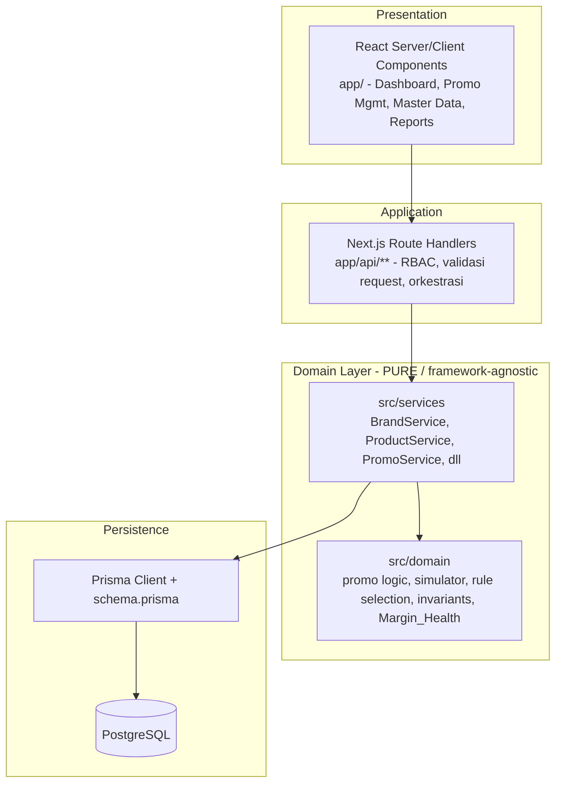

- **Presentation:** React Server/Client Components di `app/` — rendering, filter, interaksi (desktop-first).
- **Application Layer:** Route Handlers di `app/api/**` — menegakkan RBAC, validasi request, mapping error domain → HTTP, dan orkestrasi transaksi.
- **Domain Layer (pure):** `src/domain` (aturan bisnis murni — promo logic, simulator Margin/NPM, rule selection, invariant keunikan & konsistensi Brand, Margin_Health) dan `src/services` (orkestrasi domain). Lapisan ini **framework-agnostic** dan tidak mengimpor Next.js/Prisma secara langsung, sehingga dapat diuji secara independen.
- **Persistence:** Prisma Client sebagai repository terhadap PostgreSQL; menegakkan integritas relasional dan transaksi atomik (mis. status + Approval_History, lihat Property 35).

> **Catatan kemurnian domain.** Service menerima repository/port melalui dependency injection sederhana agar `src/domain` dapat dites tanpa basis data nyata. Hal ini mendukung penerapan property-based testing **bertahap** untuk Properti 1–45 sesuai catatan prioritas MVP pada Testing Strategy — tanpa mengubah ruang lingkup requirement.

### Database Schema (Final)

Skema berikut adalah realisasi konkret PostgreSQL/Prisma dari section **Data Models**. Skema ini **konsisten dengan Data Models** dan tidak menggandakannya; ia hanya menambah detail tipe, kunci, constraint, dan index yang dibutuhkan untuk build. Tipe ditulis sebagai `PostgreSQL` / `Prisma`.

> **Penegakan constraint kunci (ringkasan).** `UNIQUE(brand_id, product_id)` pada `products`; FK kepemilikan Brand pada `products`/`campaigns`/`promo_scenarios`/`cost_configurations`; `promo_scenarios.campaign_id` FK ke `campaigns`; **konsistensi Brand promo == Brand campaign** ditegakkan di service/aplikasi (`PromoService`) karena tidak dapat dinyatakan murni sebagai FK tunggal; audit fields (`created_by`, `created_at`, `updated_at`) pada Brand/Campaign/Promo/Product.

#### Table: `users`
- **Fields & Types:** `id` (uuid / String @id), `email` (text UNIQUE / String), `name` (text / String), `password_hash` (text / String, opsional bila pakai OAuth), `role` (enum `user_role` {SPV_Marketing, Admin_Marketplace} / Role), `created_at` (timestamptz / DateTime @default(now())), `updated_at` (timestamptz / DateTime @updatedAt).
- **Primary Key:** `id`.
- **Foreign Keys:** —
- **Unique Constraints:** `UNIQUE(email)`.
- **Indexes:** index pada `role` (filter pengguna per peran bila diperlukan).
- **Catatan:** mendukung NextAuth + RBAC (Req 1). `created_by` pada tabel lain mereferensikan `users.id`.

#### Table: `brands`
- **Fields & Types:** `id` (uuid / String @id), `brand_id` (text / String — Brand ID bisnis), `brand_name` (text / String), `display_name` (text / String), `status` (enum `brand_status` {Active, Archived} / BrandStatus), `created_by` (uuid / String), `created_at` (timestamptz), `updated_at` (timestamptz @updatedAt).
- **Primary Key:** `id`.
- **Foreign Keys:** `created_by` → `users.id`.
- **Unique Constraints:** `UNIQUE(brand_id)` (Req 19.2 — Brand ID duplikat ditolak).
- **Indexes:** `UNIQUE(brand_id)`; index pada `status`.

#### Table: `products`
- **Fields & Types:** `id` (uuid / String @id), `brand_id` (uuid / String FK), `product_id` (text / String — Product ID bisnis), `nama_produk` (text / String, tanpa batasan keunikan), `kategori` (text / String), `hpp` (numeric(14,2) / Decimal), `harga_jual` (numeric(14,2) / Decimal), `status` (enum `product_status` {Active, Inactive, Archived} / ProductStatus), `created_by` (uuid), `created_at` (timestamptz), `updated_at` (timestamptz @updatedAt).
- **Primary Key:** `id`.
- **Foreign Keys:** `brand_id` → `brands.id`; `created_by` → `users.id`.
- **Unique Constraints:** **`UNIQUE(brand_id, product_id)`** (Req 3.2/3.4 — keunikan semata pada kombinasi Brand + Product ID; Product ID sama lintas Brand diizinkan; Nama Produk tidak pernah unik).
- **Indexes:** `UNIQUE(brand_id, product_id)`; index pada `brand_id` (filter listing per Brand, Req 3.15); index pada `product_id` (deteksi Product ID dipakai di Brand lain, Req 3.3); index pada `status`; index pencarian substring pada `nama_produk` dan `product_id` (mis. `pg_trgm` GIN) untuk Req 3.14/9.5.

#### Table: `cost_configurations`
- **Fields & Types:** `id` (uuid / String @id), `brand_id` (uuid / String FK), `admin_fee`, `shipping_fee`, `promo_xtra`, `fee_pesanan`, `campaign_fee`, `promosi_fee`, `marketing_fee`, `ads_spending`, `affiliate_commission`, `operating_cost` (semua numeric(5,2) / Decimal, persen 0–100), `is_active` (boolean / Boolean @default(true)), `updated_at` (timestamptz @updatedAt).
- **Primary Key:** `id`.
- **Foreign Keys:** `brand_id` → `brands.id`.
- **Unique Constraints:** `UNIQUE(brand_id)` (satu set Cost_Configuration aktif per Brand, Req 4.2).
- **Indexes:** `UNIQUE(brand_id)`.
- **Catatan:** validasi rentang 0–100 ditegakkan atomik di service (Property 13); CHECK constraint per kolom (`>= 0 AND <= 100`) ditambahkan sebagai pertahanan kedua di basis data.

#### Table: `campaigns`
- **Fields & Types:** `id` (uuid / String @id), `brand_id` (uuid / String FK), `nama` (text / String), `tanggal_mulai` (date / DateTime), `tanggal_selesai` (date / DateTime), `status` (enum `campaign_status` {Draft, Active, Completed, Archived} / CampaignStatus @default(Draft)), `created_by` (uuid), `created_at` (timestamptz), `updated_at` (timestamptz @updatedAt).
- **Primary Key:** `id`.
- **Foreign Keys:** `brand_id` → `brands.id`; `created_by` → `users.id`.
- **Unique Constraints:** —
- **Indexes:** index pada `brand_id` (filter Campaign History per Brand, Req 15.2); index pada `status`; index pada `(tanggal_mulai, tanggal_selesai)` untuk filter tanggal (Req 15.2).
- **Catatan:** validasi `tanggal_selesai >= tanggal_mulai` (Req 6.2) ditegakkan di service; CHECK constraint sebagai pertahanan kedua.

#### Table: `promo_scenarios`
- **Fields & Types:** `id` (uuid / String @id), `brand_id` (uuid / String FK), `campaign_id` (uuid / String FK), `nama_promo` (text / String), `promo_type` (enum `promo_type` {Buy X Discount, Buy X Get Gift, Voucher, Flash Sale, Bundle Promo} / PromoType), `tanggal_mulai` (date / DateTime), `tanggal_selesai` (date / DateTime), `status` (enum `promo_status` {Draft, Review, Approved, Rejected, Active, Completed} / PromoStatus @default(Draft)), `execution_status` (enum `execution_status` {Approved, Sent to Admin, Marketplace Setup, Completed} / ExecutionStatus, nullable hingga Approved), `created_by` (uuid), `created_at` (timestamptz), `updated_at` (timestamptz @updatedAt).
- **Primary Key:** `id`.
- **Foreign Keys:** `brand_id` → `brands.id`; `campaign_id` → `campaigns.id` (Req 6.10/7.2 — tepat satu Campaign); `created_by` → `users.id`.
- **Unique Constraints:** —
- **Indexes:** index pada `brand_id`; index pada `campaign_id` (penelusuran promo per campaign, Req 6.11); index pada `status` (widget Dashboard & filter, Req 2/16); index pada `promo_type` (filter Promo History, Req 16.3); index pada `created_at` (Date Range inklusif Promo History, Req 16.5); index pencarian pada `nama_promo` (Req 16.2); index pada `execution_status` (Waiting for Execution, Req 2.6).
- **Catatan:** **konsistensi Brand promo == Brand campaign** (Req 6.12/7.3) ditegakkan di `PromoService` (memuat `campaign.brand_id` dan membandingkan) — tidak dapat dinyatakan sebagai FK tunggal sehingga ditegakkan di lapisan aplikasi sesuai Property 17.

#### Table: `rules`
- **Fields & Types:** `id` (uuid / String @id), `promo_id` (uuid / String FK), `min_quantity` (integer / Int, `>= 1`), `benefit_type` (enum `benefit_type` {DiscountPercent, FreeGift} / BenefitType), `discount_percent` (numeric(5,2) / Decimal, nullable — bila DiscountPercent), `gift` (text / String, nullable — bila FreeGift).
- **Primary Key:** `id`.
- **Foreign Keys:** `promo_id` → `promo_scenarios.id` (ON DELETE CASCADE).
- **Unique Constraints:** —
- **Indexes:** index pada `promo_id`.
- **Catatan:** validasi `min_quantity >= 1` (Req 8.3 / Property 21) di service; CHECK constraint sebagai pertahanan kedua. Pemilihan Rule (Property 20) adalah logika domain murni.

#### Table: `promo_products` (join — productRefs)
- **Fields & Types:** `id` (uuid / String @id), `promo_id` (uuid / String FK), `brand_id` (uuid / String), `product_id` (text / String) — identitas produk **(brand_id + product_id)**, bukan Nama Produk (Req 9.10 / Property 22).
- **Primary Key:** `id`.
- **Foreign Keys:** `promo_id` → `promo_scenarios.id` (ON DELETE CASCADE); `(brand_id, product_id)` → `products(brand_id, product_id)` (composite FK ke kunci unik produk).
- **Unique Constraints:** `UNIQUE(promo_id, brand_id, product_id)` (mencegah duplikat produk dalam satu promo, Req 9.3).
- **Indexes:** `UNIQUE(promo_id, brand_id, product_id)`; index pada `promo_id`; index pada `(brand_id, product_id)`.
- **Catatan:** referensi melalui identitas Product memastikan produk Inactive/Archived yang sudah tereferensi tetap valid secara historis (Req 9.14 / Property 24) dan mencegah hapus permanen produk tereferensi (Req 3.10 / Property 8).

#### Table: `feedback_records`
- **Fields & Types:** `id` (uuid / String @id), `promo_id` (uuid / String FK — Promo Reference), `message` (text / String), `created_by_user` (uuid / String), `created_date` (timestamptz / DateTime @default(now())), `read_by` (uuid[] / Json atau tabel pivot — untuk Unread Feedback, Req 2.6).
- **Primary Key:** `id`.
- **Foreign Keys:** `promo_id` → `promo_scenarios.id`; `created_by_user` → `users.id`.
- **Unique Constraints:** —
- **Indexes:** index pada `promo_id` (banyak Feedback_Record per promo, Req 14.5); index pada `created_date`.
- **Catatan:** utas dua arah; dibuat oleh peran mana pun yang berakses ke promo (Req 1.5 / Property 2).

#### Table: `approval_history`
- **Fields & Types:** `id` (uuid / String @id), `promo_id` (uuid / String FK), `status` (enum `promo_status` / PromoStatus), `changed_by` (uuid / String, nullable), `changed_at` (timestamptz / DateTime @default(now())).
- **Primary Key:** `id`.
- **Foreign Keys:** `promo_id` → `promo_scenarios.id`; `changed_by` → `users.id`.
- **Unique Constraints:** —
- **Indexes:** index pada `promo_id` (Approval History per promo, Req 17.1); index pada `changed_at`.
- **Catatan:** penulisan dilakukan **dalam transaksi yang sama** dengan perubahan status promo; bila penulisan gagal, perubahan status di-rollback (Req 17.3 / Property 35).

#### Table: `execution_status` (opsional — bila dipisah dari `promo_scenarios`)
- **Fields & Types:** `id` (uuid / String @id), `promo_id` (uuid / String FK UNIQUE), `status` (enum `execution_status` / ExecutionStatus), `updated_by` (uuid, nullable), `updated_at` (timestamptz @updatedAt).
- **Primary Key:** `id`.
- **Foreign Keys:** `promo_id` → `promo_scenarios.id`; `updated_by` → `users.id`.
- **Unique Constraints:** `UNIQUE(promo_id)`.
- **Indexes:** `UNIQUE(promo_id)`; index pada `status`.
- **Catatan:** **Keputusan default:** Execution_Status di-*inline* sebagai kolom `promo_scenarios.execution_status` agar sederhana untuk MVP. Tabel terpisah ini disediakan sebagai alternatif bila dibutuhkan histori perubahan eksekusi; pembaruan tetap atomik dengan rollback nilai sebelumnya bila gagal (Req 18.4 / Property 36).

#### Table: `promo_templates`
- **Fields & Types:** `id` (uuid / String @id), `name` (text / String), `promo_type` (enum `promo_type` / PromoType, nullable), `config` (jsonb / Json — pola rule/benefit), `is_built_in` (boolean / Boolean @default(false)), `created_by` (uuid, nullable), `created_at` (timestamptz), `updated_at` (timestamptz @updatedAt).
- **Primary Key:** `id`.
- **Foreign Keys:** `created_by` → `users.id`.
- **Unique Constraints:** —
- **Indexes:** index pada `is_built_in`.
- **Catatan:** lima template bawaan (Req 5.1) di-seed; jumlah template tak terbatas (Req 5.3).

#### Table: `attachments` (Nice to Have — Req 21)
- **Fields & Types:** `id` (uuid / String @id), `promo_id` (uuid / String FK), `attachment_name` (text / String), `file_url` (text / String), `uploaded_by` (uuid / String), `upload_date` (timestamptz / DateTime @default(now())).
- **Primary Key:** `id`.
- **Foreign Keys:** `promo_id` → `promo_scenarios.id` (ON DELETE CASCADE); `uploaded_by` → `users.id`.
- **Unique Constraints:** —
- **Indexes:** index pada `promo_id` (banyak Attachment per promo, Req 21.2).
- **Catatan:** di belakang feature flag; banyak attachment per promo.

#### Diagram ER (ringkas, konsisten Data Models)

Diagram berikut merangkum relasi konkret dan **konsisten dengan** hierarki kepemilikan pada Architecture dan tabel Data Models (tidak menggandakan; merujuk identitas (brand_id, product_id) pada productRefs).

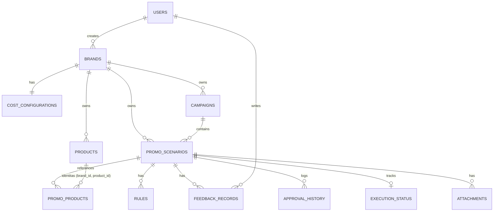

### API Contracts

Endpoint REST diimplementasikan sebagai **Next.js Route Handlers** di `app/api/**`. Setiap endpoint **menegakkan RBAC** via session NextAuth sebelum operasi domain, dan **membedakan error validasi vs error sistem** sesuai section Error Handling (validasi → 400/422 dengan pesan per field; constraint/referential → 409; error sistem → 500 dengan pesan sistem yang dibedakan; akses ditolak → 403). Kolom **RBAC** mencantumkan peran yang diizinkan. Tag **[v1.2 / nice-to-have]** menandai endpoint di luar inti MVP v1/v1.1.

**Konvensi umum:** path diprefiks `/api`; body JSON; konteks Brand dari Global Brand Selector dikirim sebagai query `?brandId=` pada listing; respons error berbentuk `{ "errorType": "validation|constraint|system|forbidden", "message": "...", "fields"?: { ... } }`.

#### Brands (Req 19)
| Method | Path | Deskripsi | RBAC |
|--------|------|-----------|------|
| GET | `/api/brands` | Daftar Brand (filter `status` opsional). | SPV_Marketing |
| POST | `/api/brands` | Buat Brand (validasi `UNIQUE(brand_id)`). | SPV_Marketing |
| PUT | `/api/brands/{id}` | Sunting Brand (simpan bila semua validasi/constraint lolos). | SPV_Marketing |
| POST | `/api/brands/{id}/archive` | Arsipkan Brand tanpa hapus data. | SPV_Marketing |
| DELETE | `/api/brands/{id}` | Hapus Brand hanya bila tak ada Product/Campaign/Promo terkait; jika ada → 409. | SPV_Marketing |

Contoh `POST /api/brands` — request: `{ "brandId": "AMK", "brandName": "AMK", "displayName": "AMK Official", "status": "Active" }`; response 201: `{ "id": "uuid", "brandId": "AMK", ... , "createdBy": "uuid", "createdAt": "..." }`. Duplikat → 409 `{ "errorType": "validation", "message": "Brand ID sudah dipakai" }` (Req 19.2).

#### Products (Req 3, 9 supporting)
| Method | Path | Deskripsi | RBAC |
|--------|------|-----------|------|
| GET | `/api/products?brandId=&q=` | List + search substring (Nama/Product ID); kolom Brand tetap tampil (Req 3.17). | SPV_Marketing |
| POST | `/api/products` | Buat produk; `UNIQUE(brand_id, product_id)`; warning bila Product ID dipakai Brand lain namun tetap simpan (Req 3.3). | SPV_Marketing |
| PUT | `/api/products/{id}` | Sunting field produk. | SPV_Marketing |
| POST | `/api/products/{id}/archive` | Arsipkan (Status Archived). | SPV_Marketing |
| DELETE | `/api/products/{id}` | Hapus bila tak direferensikan promo; jika direferensikan → 409 arahkan Archive (Req 3.10). | SPV_Marketing |
| POST | `/api/products/import` | Impor Excel/CSV; partisi baris berhasil/gagal (Req 3.12/3.13). | SPV_Marketing |
| GET | `/api/products/import/template` | Unduh template impor (Download Template). | SPV_Marketing |

Contoh `POST /api/products/import` — response 200: `{ "created": 42, "failed": [ { "row": 7, "reason": "Product ID duplikat dalam Brand" } ] }` (Property 9).

#### Cost Configuration (Req 4)
| Method | Path | Deskripsi | RBAC |
|--------|------|-----------|------|
| GET | `/api/brands/{brandId}/cost-config` | Ambil 10 komponen biaya Brand. | SPV_Marketing |
| PUT | `/api/brands/{brandId}/cost-config` | Perbarui; validasi atomik 0–100 (tolak seluruhnya bila ada yang di luar rentang, Req 4.5 / Property 13). | SPV_Marketing |

#### Campaigns (Req 6, 7)
| Method | Path | Deskripsi | RBAC |
|--------|------|-----------|------|
| GET | `/api/campaigns?brandId=&status=` | Daftar Campaign (termasuk Jumlah Promo). | SPV_Marketing |
| GET | `/api/campaigns/{id}` | Detail Campaign + daftar Promo_Scenario miliknya (container, Req 6.11). | SPV_Marketing |
| POST | `/api/campaigns` | Buat Campaign (Status awal Draft; validasi tanggal & Brand). Mendukung **inline create** dari alur promo (Req 7.12). | SPV_Marketing |
| PUT | `/api/campaigns/{id}` | Sunting Campaign (blokir bila error validasi, Req 6.6). | SPV_Marketing |
| POST | `/api/campaigns/{id}/archive` | Arsipkan Campaign. | SPV_Marketing |
| DELETE | `/api/campaigns/{id}` | Hapus bila tanpa Promo terkait; jika ada → 409 arahkan Archive (Req 6.8). | SPV_Marketing |

#### Promo Scenarios (Req 7, 8, 9, 10, 12, 24)
| Method | Path | Deskripsi | RBAC |
|--------|------|-----------|------|
| GET | `/api/promos?brandId=&campaignId=&status=` | Daftar Promo_Scenario. | SPV_Marketing |
| GET | `/api/promos/{id}` | Detail promo (Basic Info, Rules, Products, simulator inputs). | SPV_Marketing |
| POST | `/api/promos` | Buat promo (Status Draft; tepat satu Campaign; Brand promo == Brand campaign, Req 7.3). Mendukung inline campaign (Req 7.12). | SPV_Marketing |
| PUT | `/api/promos/{id}` | Sunting Basic Information (validasi tanggal/Brand/Promo_Type). | SPV_Marketing |
| POST | `/api/promos/{id}/clone` | **Clone** (salin Promo_Type, Rules, Product List; Status Draft; audit baru, Req 24 / Property 43). | SPV_Marketing |
| POST | `/api/promos/{id}/submit-for-review` | Transisi Draft → Review. | SPV_Marketing |
| POST | `/api/promos/{id}/approve` | Transisi → Approved (tulis Approval_History dalam transaksi, Req 17.3). | SPV_Marketing |
| POST | `/api/promos/{id}/reject` | Transisi → Rejected (tulis Approval_History). | SPV_Marketing |
| GET/POST/DELETE | `/api/promos/{id}/rules` | Kelola Rules (min qty ≥ 1; tak terbatas; pilih rule tertinggi terpenuhi). | SPV_Marketing |
| POST | `/api/promos/{id}/products` | Tambah produk (single/multi-select). | SPV_Marketing |
| POST | `/api/promos/{id}/products/bulk` | Bulk paste Product ID; partisi added/skipped-brand-lain/unmatched (Req 9.6/9.8 / Property 23). | SPV_Marketing |
| DELETE | `/api/promos/{id}/products/{brandId}/{productId}` | Hapus produk dari promo. | SPV_Marketing |

Contoh `POST /api/promos/{id}/products/bulk` — request: `{ "productIds": ["12345", "12346", "99999"] }`; response 200: `{ "added": ["12345","12346"], "skippedOtherBrand": [], "unmatched": ["99999"] }`.

#### Simulator (Req 10, 11, 20)
| Method | Path | Deskripsi | RBAC |
|--------|------|-----------|------|
| POST | `/api/promos/{id}/simulate` | Hitung per produk: Harga Normal, Harga Promo, Potongan, Margin Rp/%, NPM Rp/% memakai Cost_Configuration aktif Brand promo; sertakan Active Cost Configuration + Last Updated Date (Req 11.8); NPM ditunda bila cost tidak aktif (Req 11.7). | SPV_Marketing |

Contoh response 200 (ringkas): `{ "activeCostConfig": { "brandId": "uuid", "isActive": true, "lastUpdatedDate": "2025-08-25" }, "rows": [ { "productId": "KAL-12345", "hargaNormal": 100000, "hargaPromo": 80000, "potongan": 20000, "marginRp": 35000, "marginPct": 0.32, "npmRp": 22000, "npmPct": 0.22, "marginHealth": "Healthy" } ], "summary": { "total": 3, "healthy": 1, "warning": 1, "risky": 1 } }`.

#### Approved Promos & Admin Execution (Req 13, 14, 18)
| Method | Path | Deskripsi | RBAC |
|--------|------|-----------|------|
| GET | `/api/approved-promos?brandId=` | Daftar promo Approved (Nama, Brand, Campaign, Jumlah Produk, Tanggal Approve, Execution Status). | SPV_Marketing, Admin_Marketplace |
| GET | `/api/execution-board?brandId=` | Admin board: promo Approved + Campaign/Promo/Products; prioritaskan pesan error sistem (Req 14.3 / Property 30). | Admin_Marketplace, SPV_Marketing |
| PUT | `/api/promos/{id}/execution-status` | Perbarui Execution_Status (atomik; rollback bila gagal, Req 18.4). | Admin_Marketplace, SPV_Marketing |

#### Feedback (Req 1.4, 1.5, 14)
| Method | Path | Deskripsi | RBAC |
|--------|------|-----------|------|
| GET | `/api/promos/{id}/feedback` | Daftar Feedback_Record + Created By User & Created Date. | SPV_Marketing, Admin_Marketplace (yang berakses ke promo) |
| POST | `/api/promos/{id}/feedback` | Tambah Feedback_Record (utas dua arah). | SPV_Marketing, Admin_Marketplace |

#### Reports (Req 15, 16, 17)
| Method | Path | Deskripsi | RBAC |
|--------|------|-----------|------|
| GET | `/api/reports/campaign-history?brandId=&status=&dateFrom=&dateTo=` | Campaign History (termasuk Jumlah Promo nol). **[v1.2 / nice-to-have reporting sekunder]** | SPV_Marketing |
| GET | `/api/reports/promo-history?brandId=&campaignId=&promoType=&status=&q=&dateFrom=&dateTo=` | Promo History + pencarian lintas campaign (kombinasi AND; Date Range inklusif; reset → semua, Req 16 / Property 33,44). | SPV_Marketing |
| GET | `/api/reports/approval-history?promoId=` | Approval History (tiap catatan: Nama Promo, Campaign, Tanggal, Status). **[v1.2 listing]** | SPV_Marketing |

Contoh empty result `GET /api/reports/promo-history?q=xyz` → 200 `{ "items": [], "message": "Tidak ada hasil yang cocok" }` (Req 16.6).

#### Dashboard (Req 2)
| Method | Path | Deskripsi | RBAC |
|--------|------|-----------|------|
| GET | `/api/dashboard?brandId=` | Ringkasan widget (Total Campaign/Promo, per status), Work Queue (Pending Reviews, Rejected, Unread Feedback, Waiting for Execution), Recent Activity — seluruhnya difilter Brand bila `brandId` diberikan (Req 2.5/2.7 / Property 3,45). | SPV_Marketing |

### Deployment

Keputusan deployment berikut **melengkapi fase Deployment Readiness** pada tasks (Task 26.x) dan tidak mengubah ruang lingkup requirement.

| Aspek | Keputusan | Catatan |
|------|-----------|---------|
| **Hosting Provider** | **Vercel** (aplikasi Next.js) | Deploy native App Router; preview deployment per branch; serverless Route Handlers untuk API. |
| **Database Hosting** | **Managed PostgreSQL** (Neon / Supabase / Railway) | Koneksi melalui `DATABASE_URL`; gunakan connection pooling (mis. Neon pooler / PgBouncer) untuk lingkungan serverless. |
| **Environment Strategy** | `development` / `staging` / `production` via environment variables + **config loader** | Selaras **Task 26.1**. Variabel kunci: `DATABASE_URL`, `NEXTAUTH_URL`, `NEXTAUTH_SECRET`, kredensial provider auth, dan **feature flags** (Margin Health, Attachments, Promo Execution gabungan). Config loader memvalidasi variabel wajib saat boot. |
| **Migration Strategy** | **Prisma Migrate** | Selaras **Task 26.2**. `prisma migrate dev` di lokal; `prisma migrate deploy` pada pipeline staging/production sebelum rilis; skema sebagai source of truth, riwayat migrasi di-commit. |
| **Backup Strategy** | **Automated backups** dari managed Postgres + skrip **dump/restore** | Selaras **Task 26.3**. Andalkan PITR/automated daily backup penyedia; sediakan skrip `pg_dump`/`pg_restore` untuk backup manual pra-migrasi besar dan untuk portabilitas antar penyedia. |

> **Catatan keamanan.** Route Handlers yang melakukan mutasi wajib melewati pemeriksaan session + RBAC (NextAuth) sebelum operasi domain; tidak ada endpoint mutasi tanpa otorisasi. Secret (`NEXTAUTH_SECRET`, `DATABASE_URL`) dikelola sebagai environment variables terenkripsi di Vercel, tidak pernah di-commit.
